# AGENTS — Operating Rules for Codex Agents

Version: 1.4
Purpose: enforce a cyclic Feature Pack (FP) workflow with clear rails, reuse existing React pages as prototypes (often with mock data), and require stakeholder ACK plus short reflection at each stage.

**Short stakeholder commands** (paste directly in chat; comments explain purpose + prep):
`FP=FP1 mode=discovery — start`  # Define FP scope; be ready with idea, constraints, and unanswered questions.
`FP=FP1 mode=design-first — sync UX_MAP and decisions`  # Align UX_MAP/API/MODEL; be ready to confirm endpoints, entities, and CTA flows.
`FP=FP1 mode=design-first — UI change:`  # Request a UI/behavior change; include the exact change and expected user impact.
`FP=FP1 mode=design-first — generate stitch prompt`  # Generate a Stitch Prompt Pack in docs/REQUIREMENTS.md from current requirements.
`FP=FP1 mode=architecture — select stack and scaffold`  # Decide minimal stack and create front/back scaffolds (no features).
`FP=FP1 mode=tests-red — write UAT/BDD and RTM`  # Write test specs; be ready to review UAT/BDD and approve ACK for SPEC.
`FP=FP1 mode=implement — drive to green`  # Implement only mapped CTAs; confirm tests_red_ready and required API/Model decisions.
`FP=FP1 mode=gate — acceptance`  # Acceptance review; have evidence links and demo notes ready.
`FP=FP1 mode=inspector — audit`  # Audit actual code implementation; checks repository, executable code, integration points.
`FP=FP1 mode=analyst — report`  # Generate factual analysis report; requires time tracking, commits, task completion data.
`FP=FP1 mode=supervisor — decide`  # Make decisions based on analyst report; cut scope, set strict limits, assign actions.

---

## 1) Minimal documents (sources of truth)

- `docs/WORKPLAN.yaml` — FP statuses, stages, risks, **ACK/reflection**, thresholds, artifacts.
- `docs/REQUIREMENTS.md` — requirements (FR + NFR), constraints (project level).
- `docs/API.yaml` — OpenAPI contract (single source).
- `docs/MODEL.sql` — SQL/ER model.
- `docs/UX_MAP.md` — **UI Action Map**: CTA → Endpoint → State → **Page (React)** → **mock_status** (mock/mixed/real/unknown) + FP diagrams.
- `docs/TESTS.md` — strategy, **UAT/BDD**, **Acceptance**, **RTM (YAML: requirement→tests→code)**.
- `docs/QNA_DECISIONS.md` — questions/answers/gaps + **short ADRs** (single file).

> New documents/folders are forbidden (except artifacts) and must be justified by ADR in `docs/QNA_DECISIONS.md`.

---

## 2) Machine-readable workflow

```yaml
workflow:
  name: "DEVELOPMENT-FP-LIFECYCLE"
  version: "1.4"
  loop: "per-feature-pack"

  fp_statuses: [discovery, plan, design-first, architecture, tests-red, implement, tests-green, gate, released]

  documents:
    workplan: "docs/WORKPLAN.yaml"
    requirements: "docs/REQUIREMENTS.md"
    api: "docs/API.yaml"
    model: "docs/MODEL.sql"
    ux_map: "docs/UX_MAP.md"
    tests: "docs/TESTS.md"            # includes UAT/BDD, Acceptance, RTM (YAML)
    qna_decisions: "docs/QNA_DECISIONS.md"

  artifacts_policy:
    commit_to_git: false
    ci_publish: true
    local_dir_pattern: "artifacts/${FP_ID}/${YYYY}-${MM}-${DD}/"
    required:
      - "logs/back-tests.log"
      - "logs/front-tests.log"
      - "coverage/coverage-back.json"
      - "coverage/coverage-front.json"
      - "evidence/demo-notes.txt"     # text: demo steps and observations (no screenshots/video)
      - "evidence/links.md"           # links to PR/CI/ADR
      - "inspection/audit.md"         # Inspector audit (if mode=inspector was used)
      - "analysis/report.md"          # Analyst report (if mode=analyst was used)
      - "supervision/decisions.md"    # Supervisor decisions (if mode=supervisor was used)

  coverage_thresholds:
    back:  { lines: 0.60, functions: 0.50, branches: 0.45, statements: 0.60 }
    front: { lines: 0.80, functions: 0.70, branches: 0.65, statements: 0.80 }

  stakeholder_ack:
    required_at: [discovery, plan, design-first, tests-red, gate]
    record_in: "docs/WORKPLAN.yaml"
    alt_record: "docs/QNA_DECISIONS.md"

  reflection:
    at: [discovery, plan, design-first, tests-red, implement, tests-green, gate]
    record_to: "docs/WORKPLAN.yaml"

  gates:
    architecture_ready:
      requires:
        - "docs/QNA_DECISIONS.md: ADRs for front/back stack and repo layout"
        - "docs/TESTS.md: Planned Test Files aligned to chosen structure"
        - "Stakeholder ACK recorded for architecture"
    design_ready:
      requires:
        - "docs/UX_MAP.md: FP CTA filled (CTA→Endpoint→State→Page→mock_status)"
        - "docs/UX_MAP.md: 'System Design (per CTA)' — one mermaid sequenceDiagram per FP CTA"
        - "docs/UX_MAP.md: 'System Interaction Overview (FP)' — mermaid flow/component overview"
        - "docs/API.yaml and docs/MODEL.sql aligned for FP entities/endpoints (or ADR+TODO)"
        - "docs/QNA_DECISIONS.md: ADRs for critical FP decisions"
        - "Stakeholder ACK recorded (see stakeholder_ack)"
    tests_red_ready:
      requires:
        - "docs/TESTS.md: UAT/BDD for FP (plain language)"
        - "docs/TESTS.md: RTM block (requirement→tests)"
        - "Red test runs executed; log paths in artifacts/.../logs/*"
        - "Stakeholder ACK recorded"
    tests_green_ready:
      requires:
        - "All UAT/BDD green; coverage json summaries saved"
        - "Coverage thresholds met (see coverage_thresholds)"
        - "docs/UX_MAP.md updated if CTA/pages/mappings changed"
    release_gate:
      requires:
        - "docs/TESTS.md: Acceptance checklist closed for FP"
        - "docs/TESTS.md: RTM coverage = 100% for FP"
        - "docs/QNA_DECISIONS.md: ADRs captured"
        - "artifacts/.../evidence/links.md"
        - "Stakeholder ACK recorded"

  transitions:
    - { from: discovery,    to: plan,         guard: "Critical questions logged; no blocking items without owner; ACK" }
    - { from: plan,         to: design-first, guard: "WORKPLAN.yaml FP filled; risks/timebox/WIP; ACK" }
    - { from: design-first, to: architecture, guard: "design_ready passed" }
    - { from: architecture, to: tests-red,    guard: "architecture_ready passed" }
    - { from: tests-red,    to: implement,    guard: "tests_red_ready passed" }
    - { from: implement,    to: tests-green,  guard: "All tests executed; artifacts saved" }
    - { from: tests-green,  to: gate,         guard: "tests_green_ready passed" }
    - { from: gate,         to: released,     guard: "release_gate passed (with ACK)" }

  fallback_rules:
    mismatch_after_green:
      trigger: "Review/demo shows expectation mismatch"
      action:
        - "Add GAP/Question to docs/QNA_DECISIONS.md (include steps and observations)"
        - "Get Answer and add a short ADR entry"
        - "Update UAT/BDD in docs/TESTS.md (make a case red)"
        - "Return to implement → green → gate (with ACK)"
```

---

## 3) Context contracts per mode

> Each mode starts with Context Bootstrap to avoid drift.

### Common reading priority (when conflicts exist)

1) **ADR** in `docs/QNA_DECISIONS.md`
2) `docs/REQUIREMENTS.md`
3) `docs/API.yaml` ↔ `docs/MODEL.sql` (paired; conflicts require Question/ADR)
4) `docs/UX_MAP.md` (CTA→Endpoint→State→Page→mock_status)
5) `docs/TESTS.md` (UAT/BDD, RTM)

> If UAT contradicts REQUIREMENTS without ADR, stop and create Question→ADR.

### Mode: discovery

**Context Bootstrap (read order):**
`REQUIREMENTS.md` → `API.yaml` → `MODEL.sql` → `UX_MAP.md` → `TESTS.md` → `QNA_DECISIONS.md` → `WORKPLAN.yaml`
**Write:** `QNA_DECISIONS.md` (Questions/Gaps/ADR), `UX_MAP.md` (add/clarify for FP), `WORKPLAN.yaml` (stage, blockers, ACK, reflection)
**Do not edit:** code, thresholds, document structure.

**Required skill runs:**
- `.codex/skills/agentic-code/ai-development-guide` before edits (scope slicing).
- `.codex/skills/agentic-code/metacognition` before reflection (top 3 scope risks).
- `.codex/skills/agentic-code/documentation-criteria` after edits (apply doc fixes).

### Mode: plan

**Context Bootstrap:** `WORKPLAN.yaml` → `UX_MAP.md` (CTA/Pages/mock_status) → `REQUIREMENTS.md`
**Write:** `WORKPLAN.yaml` (FP tasks, risks, spikes, timebox/WIP, gate thresholds, artifacts, ACK), **links** to `UX_MAP.md`
**Do not edit:** code.

**Required skill runs:**
- `.codex/skills/agentic-code/ai-development-guide` before edits (planning heuristics).
- `.codex/skills/agentic-code/metacognition` before reflection (WIP/timebox sanity).
- `.codex/skills/agentic-code/documentation-criteria` after edits (apply doc fixes).

### Mode: design-first

**Context Bootstrap:** `MODEL.sql` ↔ `API.yaml` ↔ `UX_MAP.md` → `QNA_DECISIONS.md` → `REQUIREMENTS.md` → `WORKPLAN.yaml`

**Required skill runs:**
- `.codex/skills/agentic-code/implementation-approach` before edits (architecture alignment).
- `.codex/skills/agentic-code/metacognition` before reflection (assumptions → Questions/ADRs).
- `.codex/skills/agentic-code/documentation-criteria` after edits (apply doc fixes).

**Required actions (strict):**

1. Validate `MODEL.sql` and `API.yaml` alignment; log all mismatches in `docs/QNA_DECISIONS.md` (Question→Answer→ADR).
2. Update `docs/UX_MAP.md` for the current FP: fill **Page / Endpoint(s) / State keys / Mock Status** for each CTA.
3. **Interaction design (mandatory):**

   * In `docs/UX_MAP.md`, add `## System Design (per CTA)` and for **each FP CTA** include **one** diagram:
     * `mermaid` `sequenceDiagram` with participants: `User`, `PageComponent`, `FrontStore`, `API Controller`, `Service`, `Repo`, `External` (if any).
   * Add `## System Interaction Overview (FP)` — a `mermaid` component/flow overview with front layers, back modules, and external systems.
4. In `docs/WORKPLAN.yaml`: `status: design-first`, `reflection`, **ACK**.
5. Record UX baseline tokens and Stitch references in `docs/REQUIREMENTS.md` (reference-only, no production code).

**Forbidden:** change code/thresholds/document structure.
**Goal:** pass `design_ready`.

### Mode: architecture

**Context Bootstrap:** `REQUIREMENTS.md` → `UX_MAP.md` → `API.yaml` → `MODEL.sql` → `TESTS.md` → `QNA_DECISIONS.md` → `WORKPLAN.yaml`

**Required skill runs:**
- `.codex/skills/agentic-code/implementation-approach` before edits (stack/layout rules).
- `.codex/skills/agentic-code/ai-development-guide` before decisions (simplicity/maintainability).
- `.codex/skills/agentic-code/metacognition` before reflection (tradeoff log).
- `.codex/skills/agentic-code/documentation-criteria` after edits (ADR quality).

**Required actions (strict):**

1. Decide minimal front/back stack and record ADRs in `docs/QNA_DECISIONS.md`.
2. Define repo layout and test folder conventions in ADRs.
3. Update `docs/TESTS.md` Planned Test Files to match the chosen structure.
4. Create minimal scaffolds under `front/` and `back/` (no feature implementation).
5. Update `docs/WORKPLAN.yaml`: `status: architecture`, `reflection`, **ACK**.

**Forbidden:** add product features or change workflow thresholds.
**Goal:** pass `architecture_ready`.

### Mode: tests-red

**Context Bootstrap:** `TESTS.md` → `UX_MAP.md` → `REQUIREMENTS.md` → `API.yaml` → `WORKPLAN.yaml`

**Required skill runs:**
- `.codex/skills/agentic-code/testing-strategy` before SPEC edits (UAT/BDD/RTM structure).
- `.codex/skills/agentic-code/testing` before Planned Test Files (naming/structure).
- `.codex/skills/agentic-code/documentation-criteria` after SPEC edits (clarity/fixes).

**Two-phase order (strict):**

**A) Phase: SPEC (no code)**
1) In `docs/TESTS.md` (FP section):
   - UAT/BDD (plain language: user steps, UI expectations, data expectations).
   - System/integration/unit list.
   - **RTM (YAML):** requirement → tests → code_targets (front/back).
   - **Planned Test Files:** list of test paths/names.
2) Update `docs/WORKPLAN.yaml` for FP:
   - `status: tests-red`
   - `tests_phase: spec`
   - `reflection: "<short>"`
   - request and record **ACK** for test spec.
3) **Forbidden:** write or change any tests or implementation; running existing tests is allowed but does not unlock transition.

**B) Phase: CODE (only after ACK on Spec)**
1) Ensure `WORKPLAN.yaml` has `tests_phase: spec` and `ack`.
2) Write **only** test code per Planned Test Files in `TESTS.md`. Do not touch implementation.
3) Run tests; obtain **red** results for the new cases (expected).
4) Save artifacts:
   - `artifacts/<FP>/<date>/logs/*`
   - optional coverage summary if needed.
5) Update `WORKPLAN.yaml`:
   - `tests_phase: code`
   - `reflection: "<short>"`

**Gate → `tests_red_ready` (minimum):**
- `TESTS.md`: UAT/BDD + RTM + Planned Test Files (ACK on Spec recorded).
- New tests written and failing for expected reasons (red runs exist).
- Log paths recorded (`artifacts/.../logs/*`).
- `WORKPLAN.yaml`: `status=tests-red`, `tests_phase=code`, **ACK** on Spec recorded.

### Mode: implement

> Guard: do not start `implement` until `tests_red_ready` is met and `WORKPLAN.yaml` has `tests_phase: code` with evidence.

**Context Bootstrap (strict):**

1. **RTM** from `TESTS.md` (what must go green)
2. **UAT/BDD** scenarios (user-visible behavior)
3. **UX_MAP.md** — FP CTA → Endpoint → State → **Page (React)** → **mock_status**
4. `API.yaml` — contract for used endpoints
5. `MODEL.sql` — required tables/fields
6. `WORKPLAN.yaml` — tasks/risks

**Required skill runs:**
- `.codex/skills/agentic-code/implementation-approach` before coding (minimal-change plan).
- `.codex/skills/agentic-code/coding-rules` before coding (style/patterns).
- `.codex/skills/agentic-code/testing` during fixes (no cheating).

**Scope resolution (what to implement):**

* Use the CTA/pages list for the FP from `UX_MAP.md`: `cta_id, page_path (react), mock_status, endpoint(s), state_keys`.
* If `mock_status=mock` or `mixed`, replace mocks with real requests for the listed endpoints.
* Validate endpoints in `API.yaml` and data in `MODEL.sql`; mismatches require Question→ADR (no guessing).
* Cross-check RTM coverage to know what to make green.

**Write:**

* Code: `front/src/**` (only pages/CTAs listed for the FP), `back/src/**` (only endpoints in `API.yaml`).
* Artifacts: `artifacts/<FP>/<date>/coverage/*.json`, `.../logs/*`
* Docs: if CTA/Endpoint/State mappings change, update `UX_MAP.md`.
* `WORKPLAN.yaml`: short reflection.

**Forbidden:**

* No pages/CTAs outside the FP list in `UX_MAP.md`.
* Do not change `API.yaml`/`MODEL.sql` without Question→ADR.
* Do not delete or bypass mock pages; remove mocks only where the FP requires it.

### Mode: tests-green

**Context Bootstrap:** `TESTS.md` (RTM, UAT/BDD) → `UX_MAP.md` → `WORKPLAN.yaml`
**Required skill runs:**
- `.codex/skills/agentic-code/testing-strategy` before running tests (coverage + artifacts).
- `.codex/skills/agentic-code/integration-e2e-testing` before any e2e (mark N/A if none).
- `.codex/skills/agentic-code/documentation-criteria` after evidence docs (demo-notes clarity).
**Actions:** run tests; verify thresholds; save coverage json-summary and logs; `evidence/demo-notes.txt` with demo steps and observations.
**Write:** `WORKPLAN.yaml` (reflection).
**Goal:** pass `tests_green_ready`.

### Mode: gate

**Context Bootstrap:** `TESTS.md` (Acceptance, RTM) → `QNA_DECISIONS.md` → `WORKPLAN.yaml` → `artifacts/<FP>/<date>/...`
**Required skill runs:**
- `.codex/skills/agentic-code/documentation-criteria` after checks (acceptance/ADR completeness).
- `.codex/skills/agentic-code/testing-strategy` during checks (RTM=100%, coverage thresholds).
- `.codex/skills/agentic-code/metacognition` before decision (postmortem bullets).
**Actions:** complete Acceptance; verify RTM=100%; ADRs closed; collect `evidence/links.md` (PR/CI/ADR); record **ACK** in `WORKPLAN.yaml`.
**Decision:** PASS/REJECT (+ reason and target mode).

### Mode: inspector

**Context Bootstrap (read order):**
`WORKPLAN.yaml` (scope, status) → `UX_MAP.md` (claimed CTAs) → `API.yaml` (claimed endpoints) → actual source files in `front/src/` and `back/src/` → test files → build outputs

**Required skill runs:**
- `.codex/skills/agentic-code/coding-rules` before audit (understand code structure).
- `.codex/skills/agentic-code/implementation-approach` during audit (verify integration).

**Required actions (strict):**

1. Read actual source files (not documentation):
   - Frontend: `front/src/**/*.tsx`, `front/src/**/*.ts`
   - Backend: `back/src/**/*.ts`
   - Tests: `front/__tests__/**`, `back/__tests__/**`

2. Trace execution paths:
   - Find entry points (main.ts, App.tsx, controllers)
   - Follow call chains
   - Verify integration between components

3. Classify each claimed feature:
   - 🟢 Implemented: code exists, is called, works
   - 🟡 Partially: structure exists but incomplete
   - 🔴 Absent: TODO, stub, or missing

4. Find dead code:
   - Unused files
   - Unused functions/classes
   - Dead branches (never called)

5. Check for stubs:
   - TODO/FIXME comments
   - Empty implementations
   - Mock/placeholder code

6. Write audit report:
   - Component-by-component breakdown
   - 🟢/🟡/🔴 classification
   - List of issues found
   - Save to `artifacts/${FP_ID}/${YYYY}-${MM}-${DD}/inspection/audit.md`

**Forbidden:** propose improvements, refactor, optimize, praise design.

**Goal:** objective picture of what actually exists in code.

---

## 4) Gates and thresholds (human summary)

* **design_ready** requires:
  * current `MODEL.sql` and `API.yaml` for all FP entities/endpoints (or ADR + TODO),
  * CTA rows complete in `UX_MAP.md` (Page/Endpoint/State/Mock),
  * diagrams in `UX_MAP.md`: **System Design (per CTA)** (one `sequenceDiagram` per CTA) and **System Interaction Overview (FP)**,
  * ADRs in `QNA_DECISIONS.md`,
  * **ACK** recorded in `WORKPLAN.yaml`.

* **tests_red_ready** requires:
  * `TESTS.md` includes UAT/BDD, RTM, Planned Test Files, with **ACK** on SPEC.
  * Test code created (Phase: CODE) and **red** for expected reasons; log paths in `artifacts/.../logs/*`.
  * `WORKPLAN.yaml` for FP: `status=tests-red`, `tests_phase=code`, `reflection` updated.

* **tests_green_ready** requires: all UAT/BDD green; thresholds met; `UX_MAP.md` updated if mappings changed.

* **release_gate** requires: Acceptance closed; RTM=100% for FP; ADRs present; artifacts collected; **ACK** recorded.

---

## 5) Policies and prohibitions (anti-bypass)

* Do **not** change: `AGENTS.md`, coverage thresholds, workflow, or document structure.
* Do **not** edit `REQUIREMENTS.md` directly: all changes must go through `QNA_DECISIONS.md` (Question→Answer→ADR).
* Do **not** remove mocks outside `implement` and outside CTA/Pages listed for the FP in `UX_MAP.md`.
* Do **not** change FP statuses in `WORKPLAN.yaml` without evidence and required **ACK**.
* Do **not** delete Questions/Gaps/ADRs — only mark as closed with a decision link.
* Do **not** enter `implement` unless `tests_phase: code` is set and `tests_red_ready` is met.
* Web/MCP are disabled.
* Do **not** add new docs/folders (except artifacts) without ADR justification in `QNA_DECISIONS.md`.
* UX baseline is required in design-first and validated in gate (see `docs/TESTS.md` checklist).
* Create top-level `front/` and `back/` only after architecture ADRs are recorded.

## Skills policy

- Agents MUST prefer repo skills when repeating workflows (doc review, testing strategy, UX baseline).
- If a role requires a skill run, it must be executed and reflected in docs (no silent runs).

## Skills preflight check

- Before starting any mode, verify the required skill folders exist under `.codex/skills/agentic-code/**` and include `SKILL.md`.
- Refuse to start a mode if any required skill is missing.
- Confirm the role references at least one installed skill by name.

## Skill evidence

- Each mode must write 1–3 bullets in `docs/WORKPLAN.yaml` reflection noting which skills were run and what was validated/fixed.
- Gate must explicitly note documentation-criteria and testing-strategy checks.

---

## 6) Reflection and ACK

For `discovery, plan, design-first, tests-red, implement, tests-green, gate`: record a short **reflection** in `WORKPLAN.yaml`.
For `discovery, plan, design-first, tests-red, gate`: record **ACK** in `WORKPLAN.yaml`.

---

## 7) Fallback when expectations mismatch

1. Log a GAP/Question in `QNA_DECISIONS.md` (include reproduction steps).
2. Get Answer and add a short ADR entry.
3. Update UAT/BDD in `TESTS.md` and make the case **red**.
4. Return to `implement` → green → `gate` (with ACK).

---

## 8) Change requests (CR) for UI/behavior

Trigger: any stakeholder request like “adjust UI,” “change redirect,” “add validation,” “rename a button,” “change error message,” etc.

Workflow (single FP):
1) mode=design-first
   - `QNA_DECISIONS.md`: create GAP; after agreement add Answer + short ADR "<change topic>".
   - `REQUIREMENTS.md`: add/update related FR/NFR.
   - `UX_MAP.md`:
     - update CTA/Page rows (Endpoint/State/Navigation).
     - update diagrams: *System Design (per CTA)* (sequence) and, if needed, *Overview (FP)*.
   - `API.yaml` / `MODEL.sql`: only change if required by new behavior; otherwise record "no change".
   - **Impact Analysis (required)**: append a table at end of `UX_MAP.md`:
     ```
     | Change ID | CTA_ID | Files.front | Files.back | Tests.toCreateOrUpdate |
     |-----------|--------|-------------|------------|------------------------|
     | CR-YYYYMMDD-01 | CTA-023 | ["src/pages/ProjectCreate.tsx"] | ["src/modules/projects/controller.ts"] | ["front/__tests__/fp001/create.redirect.test.tsx","back/.../projects.e2e.spec.ts"] |
     ```
   - `WORKPLAN.yaml`: reflection and **ACK** (scope=FP:<id>:design-first-CR).
   - Re-run `design_ready` logically (diagrams + Impact Analysis required).

2) mode=tests-red (two phases)
   - **SPEC**: update UAT/BDD and RTM for the change; fill *Planned Test Files*; request and record **ACK**.
   - **CODE**: write tests per plan; expected **red** on new cases; save logs to artifacts; `WORKPLAN.yaml`: `tests_phase: code`.

3) mode=implement
   - Implement **strictly** per Impact Analysis and RTM; only touch affected parts.
   - Run tests to green; save coverage/logs; update `UX_MAP.md` if mappings changed.

4) mode=gate
   - Acceptance; RTM=100%; ADR/ACK present; PASS/REJECT.

---

## 9) Appendix — Diagram templates (copy into `UX_MAP.md`)

**Sequence (per CTA):**

```mermaid
sequenceDiagram
  autonumber
  actor U as User
  participant P as PageComponent(<PageName>)
  participant S as FrontStore
  participant C as API Controller(<endpoint>)
  participant SV as Service(<ServiceName>)
  participant R as Repo(<RepoName>)
  participant EXT as External(<System>)  %% remove if not used

  U->>P: Click "<CTA>"
  P->>S: dispatch(<action>)
  S->>C: <HTTP VERB> <path> {payload}
  C->>SV: validate & call
  SV->>R: persist/query
  SV-->>C: result {…}
  C-->>S: return {…}
  S-->>P: update state
  P-->>U: render result
```



**Overview (per FP):**


---

## 10) Analysis and Supervision Roles

### Role: Inspector (Implementation Auditor)

**Purpose:**
Answers: "What is actually implemented and working if you open the project right now?"

**Why it exists:**
Analyst relies on your reports.
But you regularly:
- Count "almost ready" as ready
- Confuse architectural stubs with implemented functionality
- Overestimate completion degree

Inspector is a role that doesn't believe words at all.
Only repository. Only code. Only facts.

**Short description:**
- Analyst looks at actions.
- Inspector looks at result in code.

**Responsibilities:**
- Review repository
- Check actual implementation state
- Separate:
  - 🟢 implemented
  - 🟡 partially
  - 🔴 absent / declarative
- Check code connectivity
- Find "empty" constructs (TODO, stubs, dead branches)

**What Inspector does NOT do:**
- ❌ Does not propose architecture
- ❌ Does not improve code
- ❌ Does not optimize
- ❌ Does not refactor
- ❌ Does not praise for "beautifully designed"

This is not an architect and not a reviewer.
This is an auditor of fact existence.

**Data sources (strict):**
- Git repository
- Actual files
- Entry points
- Actually called code
- Tests (if exist)
- Build / run (if applicable)

**State classification (mandatory):**

**🟢 Implemented:**
- Code exists
- Is used
- Can be run / called
- Has connection with rest of system

**🟡 Partially implemented:**
- Structures exist, but:
  - no call
  - no integration
  - logic breaks off
  - behavior incomplete

**🔴 Not implemented:**
- TODO
- Stubs
- Comments instead of logic
- Files without usage
- "Planned" functionality

**Typical inspector questions:**
- Where is the entry point?
- Does anyone actually call this code?
- What happens on startup?
- Where does the implemented chain end?
- Which files exist only "for future"?
- What looks like a system but is a mockup?

**Report format (example):**
```
Component: Combat System

🟢 Implemented:
- PlayerController movement
- Hit detection (melee)
- Damage application

🟡 Partially:
- Enemy AI (FSM declared, only 1 state used)
- Animation hooks (signals exist, logic incomplete)

🔴 Absent:
- Enemy reactions
- Death handling
- Difficulty scaling

Observations:
- 3 classes unused
- FSM doesn't switch beyond idle
- Comments describe behavior that doesn't exist
```

**Activation:**
`mode=inspector — audit`

**Output location:**
`artifacts/${FP_ID}/${YYYY}-${MM}-${DD}/inspection/audit.md`

**Output format:**
- Component-by-component breakdown
- 🟢/🟡/🔴 classification per feature/component
- List of unused/dead code
- List of missing integrations
- List of TODO/stubs

---

### Role: Analyst

**Purpose:**
Cold and emotionless answer to: "What is actually happening?"
Not what you feel, not what you wanted, but what is measurably done.

**Short description:** Analyst is anti-self-deception.

**Responsibilities:**
- Record factual actions
- Compare plan ↔ reality
- Identify bottlenecks
- Form objective progress picture

**What Analyst does NOT do:**
- ❌ Does not motivate
- ❌ Does not console
- ❌ Does not invent excuses
- ❌ Does not suggest "how to feel better"

**Input data (strict):**
- Inspector audit report from `artifacts/.../inspection/audit.md` (if available)
- Time spent (hours)
- Number of sessions
- Closed tasks
- Commits / assets / builds / texts
- Days without progress
- Failure reasons (factual, not psychological)
- `docs/WORKPLAN.yaml` — planned vs actual time, scope completion
- Git commits — actual code changes
- `artifacts/` — test results, coverage, build outputs
- Task tracking (if available)

**Note:** If Inspector audit exists, Analyst must reference it when comparing claimed progress with actual code state.

**Output data:**
- 📊 Table/list of facts
- 📉 Delta: plan → fact
- 🔍 Top-3 reasons for decline
- ⚠️ Recurring failure patterns
- 🧊 Cold conclusion (without advice)

**Typical analyst questions:**
- How many hours were actually invested?
- What exactly was created?
- Which tasks repeat without closure?
- Where does energy leak?
- What looks like work but doesn't produce results?

**Report format (example):**
```
Period: 7 days
Plan: 14 hours
Fact: 5.5 hours

Result:
- 1 prototype
- 0 completed features
- 3 started and abandoned tasks

Observations:
- Work happened in bursts ≤40 min
- 3 days without project entry
- Main time drain — preparation, not implementation
```

**Activation:**
`mode=analyst — report`

**Output location:**
`artifacts/${FP_ID}/${YYYY}-${MM}-${DD}/analysis/report.md`

---

### Role: Supervisor

**Purpose:**
Answers: "What to do next and why are you stuck again?"

If analyst is a mirror,
then supervisor is a hard manager without mercy.

**Responsibilities:**
- Make decisions based on analyst report
- Cut unnecessary scope
- Fix focus
- Assign limited, executable actions
- Stop project sprawl

**What Supervisor does NOT do:**
- ❌ Does not inspire
- ❌ Does not discuss "what if"
- ❌ Does not expand scope
- ❌ Does not allow "just a bit more preparation"

**Main functions:**

**1. Behavior diagnosis:**
- Where do you avoid?
- Where do you overcomplicate?
- Where do you hide behind "quality"?

**2. Hard decision making:**
- What to cut
- What to freeze
- What to do even if you don't want to

**3. Setting boundaries:**
- Clear volume
- Clear deadline
- Clear "done" criterion

**Typical supervisor commands:**
- "This is unnecessary. Remove it."
- "You're planning instead of executing again."
- "One task. 90 minutes. No branching."
- "Failure is not a reason to change goal, but a reason to tighten process."

**Decision format (example):**
```
Based on report:

Problem:
- Insufficient session depth
- Frequent context switching

Decision:
- 1 task per day
- Timebox: 60–90 min
- Ban on refactoring and improvements

Control:
- Report in 24 hours
- If fails — simplify 2x more
```

**Activation:**
`mode=supervisor — decide`

**Required input:**
- Analyst report from `artifacts/.../analysis/report.md`
- Inspector audit from `artifacts/.../inspection/audit.md` (if available)
- Current FP status from `docs/WORKPLAN.yaml`
- Current scope from `docs/WORKPLAN.yaml` scope field

**Output location:**
`artifacts/${FP_ID}/${YYYY}-${MM}-${DD}/supervision/decisions.md`

**Actions:**
- Update `docs/WORKPLAN.yaml` scope (cut items)
- Update `docs/WORKPLAN.yaml` timebox (reduce if needed)
- Set explicit limits in reflection section

---

### Role Connection Flow

```
User → (actions)
  ↓
Inspector → (what actually exists in code)
  ↓
Analyst → (what actually happened vs plan)
  ↓
Supervisor → (what to do next and what to cut)
  ↓
New cycle
```

**⚠️ No skipping roles.**
- If you skip Inspector → Analyst relies on false self-reports
- If you skip Analyst → Supervisor makes decisions without context
- If you skip Supervisor → you keep repeating same mistakes

**Workflow integration:**
1. **Inspector** audits code → creates `inspection/audit.md`
2. **Analyst** compares audit with time/plan → creates `analysis/report.md` (references inspector findings)
3. **Supervisor** makes decisions based on both → creates `supervision/decisions.md` (references both reports)

**When to activate:**
- Inspector: When progress claims don't match code state, before major decisions, after "almost done" claims
- Analyst: After inspector report, when progress stalls, at regular intervals
- Supervisor: After analyst report, when scope needs cutting, when stuck in loops
