# UX Map

## FP1: Browse & Play + Admin Authoring

### CTA table

| CTA_ID | CTA | Page | Endpoint(s) | State keys | mock_status |
| --- | --- | --- | --- | --- | --- |
| CTA-001 | Browse catalog | CatalogPage (/) | TODO: GET /games?tag=...&sort=... | ui.loading, ui.empty, ui.error, games.list, games.filters | unknown |
| CTA-002 | Filter/sort by tags | CatalogPage (/) | TODO: GET /tags (optional, derived from games tags); GET /games?tag=... | ui.loading, ui.empty, ui.error, tags.list, games.filters | unknown |
| CTA-003 | Open game page | GamePage (/games/:gameId) | TODO: GET /games/{id} | ui.loading, ui.error, game.current | unknown |
| CTA-004 | Play web build in browser | GamePage (/games/:gameId) | TODO: GET /games/{id} (includes description_md, repo_url, cover_url, tags_user, tags_system, status, build_url/build_id) | ui.loading, ui.error, build.url | unknown |
| CTA-005 | Admin create team | AdminTeamsPage (/admin/teams) | TODO: POST /admin/teams | ui.loading, ui.error, admin.teams.form | unknown |
| CTA-006 | Admin create/edit game details | AdminGameEditorPage (/admin/games/:gameId) | TODO: POST/PATCH /admin/games | ui.loading, ui.error, admin.game.form | unknown |
| CTA-007 | Admin upload build ZIP | AdminGameEditorPage (/admin/games/:gameId) | TODO: POST /admin/games/{id}/build | ui.loading, ui.error, admin.build.upload | unknown |
| CTA-008 | Admin preview build | AdminGameEditorPage (/admin/games/:gameId) | TODO: GET /games/{id} (build_url/build_id) | ui.loading, ui.error, admin.build.preview | unknown |
| CTA-009 | Admin publish game | AdminGameEditorPage (/admin/games/:gameId) | TODO: POST /admin/games/{id}/publish or /status | ui.loading, ui.error, admin.game.status | unknown |
| CTA-010 | Admin set tags on game | AdminGameEditorPage (/admin/games/:gameId) | TODO: POST/PATCH /admin/games/{id}/tags (tags_user/tags_system) | ui.loading, ui.error, admin.game.tags | unknown |
| CTA-011 | Admin change status + remark | AdminGameEditorPage (/admin/games/:gameId) | TODO: POST /admin/games/{id}/status, POST /admin/games/{id}/remarks | ui.loading, ui.error, admin.game.status | unknown |

### System Design (per CTA)

#### CTA-001 Browse catalog

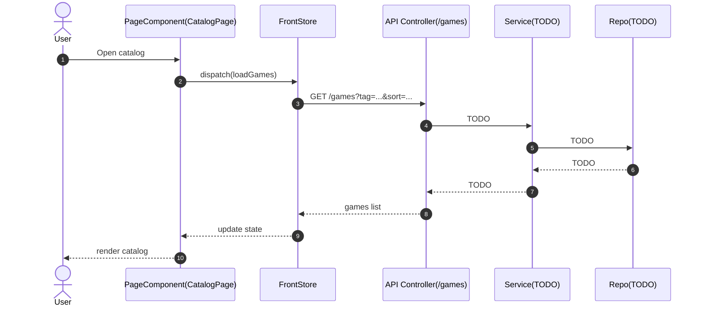

#### CTA-002 Filter/sort by tags

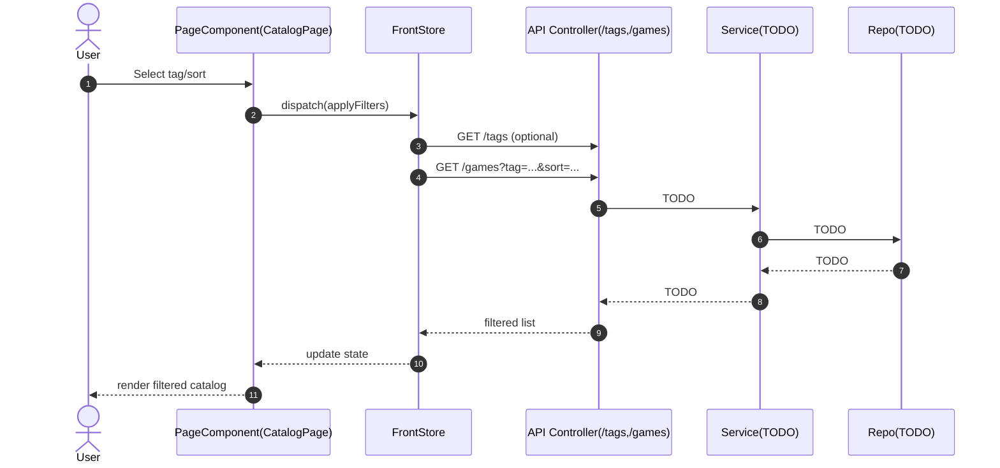

#### CTA-003 Open game page

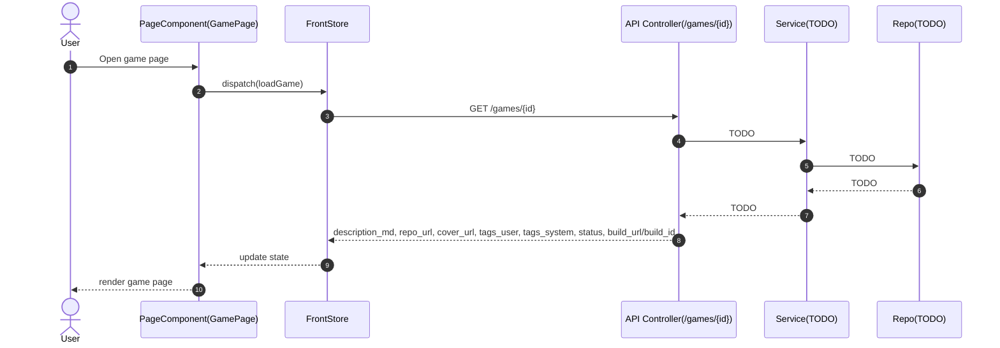

#### CTA-004 Play web build in browser

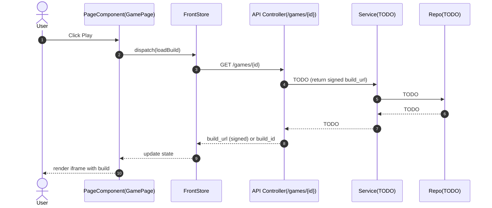

#### CTA-005 Admin create team

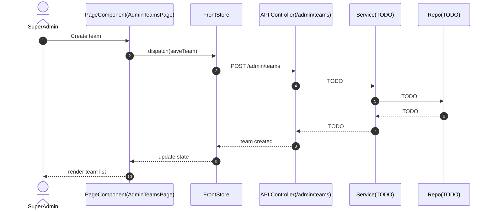

#### CTA-006 Admin create/edit game details

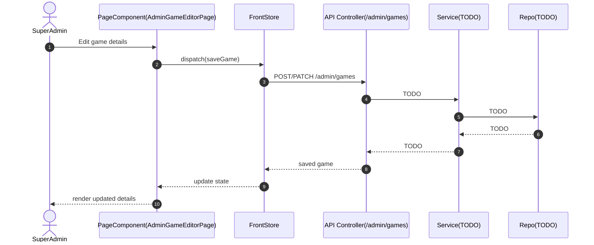

#### CTA-007 Admin upload build ZIP

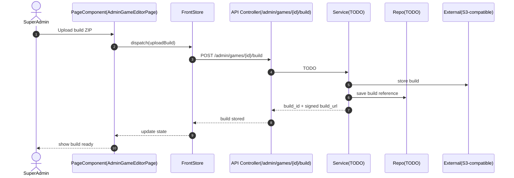

#### CTA-008 Admin preview build

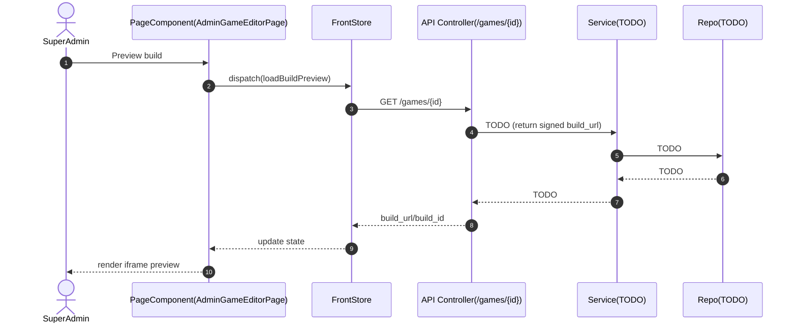

#### CTA-009 Admin publish game

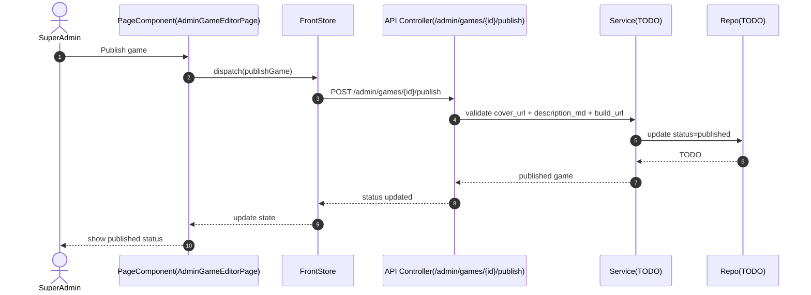

#### CTA-010 Admin set tags on game

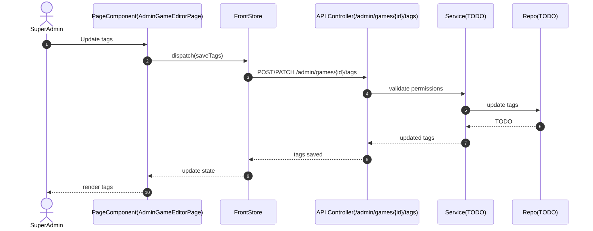

#### CTA-011 Admin change status + remark

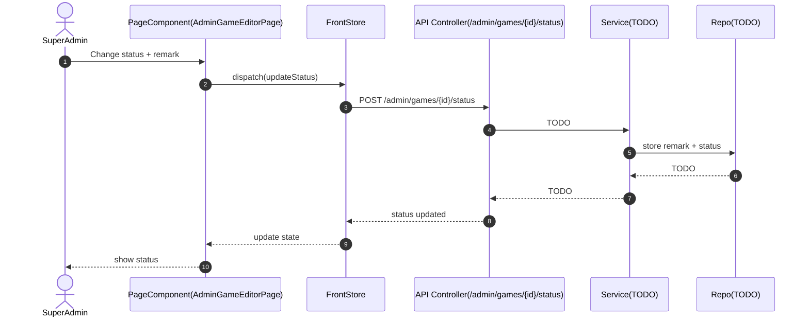

### System Interaction Overview (FP)

```mermaid
flowchart LR
  subgraph Frontend
    CP[CatalogPage]
    GP[GamePage]
    AG[AdminGameEditorPage]
    ATE[AdminTeamsPage]
    FS[FrontStore]
  end
  subgraph Backend
    CTRL[Controller: Games/Tags/Admin]
    SVC[Service: TODO]
    REPO[Repo: TODO]
    MDB[(MongoDB)]
  end
  EXT[External Storage (S3-compatible)]

  CP --> FS --> CTRL
  GP --> FS --> CTRL
  AG --> FS --> CTRL
  ATE --> FS --> CTRL
  CTRL --> SVC --> REPO --> MDB
  SVC --> EXT
```

---

## FP4: User Accounts & Windows 95 UI

### CTA table

| CTA_ID | CTA | Page | Endpoint(s) | State keys | mock_status |
| --- | --- | --- | --- | --- | --- |
| CTA-FP4-001 | Register new account | AuthModal (global) | POST /auth/register | auth.modal.open, auth.mode (login/register/recovery), auth.form, auth.error | unknown |
| CTA-FP4-002 | Login with email or username | AuthModal (global) | POST /auth/login | auth.modal.open, auth.mode, auth.form, auth.error, user.current, user.token | unknown |
| CTA-FP4-003 | Request password recovery | AuthModal (global) | POST /auth/recovery/request | auth.modal.open, auth.mode (recovery), auth.form, auth.error | unknown |
| CTA-FP4-004 | Verify recovery code and reset password | AuthModal (global) | POST /auth/recovery/verify | auth.modal.open, auth.mode (recovery), auth.form, auth.error | unknown |
| CTA-FP4-005 | Open login/registration modal | Header (top-left) | - | auth.modal.open, auth.mode | unknown |
| CTA-FP4-006 | Logout | Header (burger menu) | - | user.current (clear), user.token (clear) | unknown |
| CTA-FP4-007 | Browse catalog (home page) | CatalogPage (/) | GET /games?tag=...&title=...&teamId=... | ui.loading, ui.empty, ui.error, games.list, games.filters | unknown |
| CTA-FP4-008 | Search games by title | CatalogPage (/) | GET /games?title=... | games.filters.title, games.list | unknown |
| CTA-FP4-009 | Filter games by team | CatalogPage (/) | GET /games?teamId=... | games.filters.teamId, games.list | unknown |
| CTA-FP4-010 | View all teams | TeamsPage (/teams) | GET /teams | ui.loading, ui.error, teams.list | unknown |
| CTA-FP4-011 | View team's game catalog | TeamsPage (/teams) or CatalogPage | GET /teams/{id}/games | ui.loading, ui.error, games.list (filtered) | unknown |
| CTA-FP4-012 | Open game page | GamePage (/games/:gameId) | GET /games/{id} | ui.loading, ui.error, game.current | unknown |
| CTA-FP4-013 | View game comments | GamePage (/games/:gameId) | GET /games/{id}/comments | ui.loading, ui.error, comments.list | unknown |
| CTA-FP4-014 | Post comment on game | GamePage (/games/:gameId) | POST /games/{id}/comments | comments.form, comments.error, comments.list | unknown |
| CTA-FP4-015 | Play game (open modal) | GamePage (/games/:gameId) | GET /games/{id} (build_url) | game.playModal.open, game.build.url | unknown |
| CTA-FP4-016 | Create new team | TeamsPage (/teams) | POST /teams | teams.form, teams.error, teams.list | unknown |
| CTA-FP4-017 | Add user to team | TeamsPage (/teams) | POST /teams/{id}/members | teams.members.form, teams.error, teams.current | unknown |
| CTA-FP4-018 | Transfer team leadership | TeamsPage (/teams) | POST /teams/{id}/leader | teams.leader.form, teams.error, teams.current | unknown |
| CTA-FP4-019 | Create new game | EditorPage (/editor/games/new) | POST /games | editor.game.form, editor.error, editor.game.current | unknown |
| CTA-FP4-020 | Edit game (team member) | EditorPage (/editor/games/:gameId) | PATCH /games/{id} | editor.game.form, editor.error, editor.game.current | unknown |
| CTA-FP4-021 | Edit game (super admin, any game) | EditorPage (/editor/games/:gameId) | PATCH /games/{id} | editor.game.form, editor.error, editor.game.current | unknown |
| CTA-FP4-022 | Upload build ZIP | EditorPage (/editor/games/:gameId) | POST /games/{id}/build | editor.build.upload, editor.build.error, editor.game.current | unknown |
| CTA-FP4-023 | Publish game | EditorPage (/editor/games/:gameId) | POST /games/{id}/publish | editor.game.status, editor.error | unknown |
| CTA-FP4-024 | Archive game | EditorPage (/editor/games/:gameId) | POST /games/{id}/archive | editor.game.status, editor.error | unknown |
| CTA-FP4-025 | Super admin force status change | EditorPage (/editor/games/:gameId) | POST /games/{id}/status | editor.game.status, editor.game.adminRemark, editor.error | unknown |
| CTA-FP4-026 | Set game tags | EditorPage (/editor/games/:gameId) | PATCH /games/{id}/tags | editor.game.tags, editor.error | unknown |

### System Design (per CTA)

#### CTA-FP4-001 Register new account

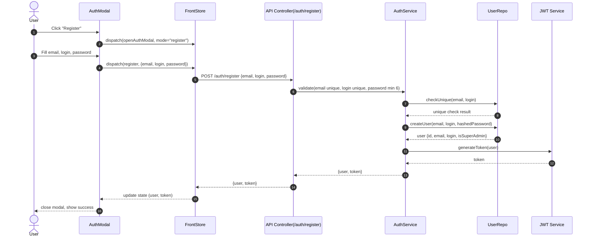

#### CTA-FP4-002 Login with email or username

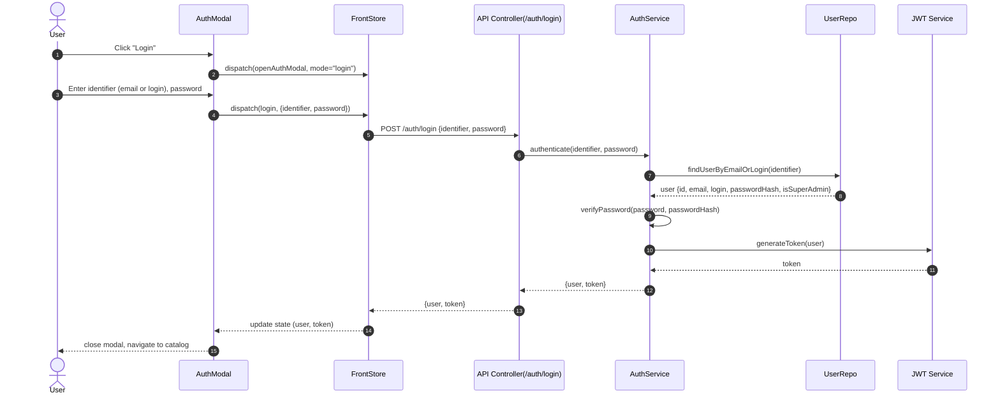

#### CTA-FP4-003 Request password recovery

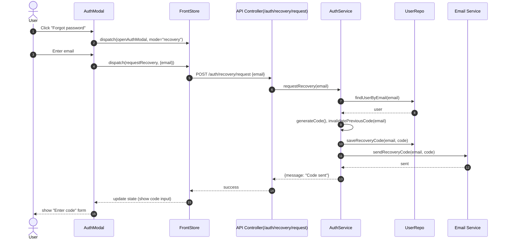

#### CTA-FP4-004 Verify recovery code and reset password

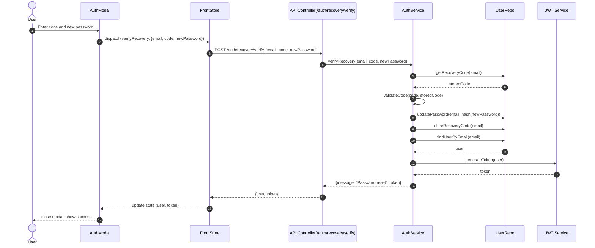

#### CTA-FP4-012 Open game page

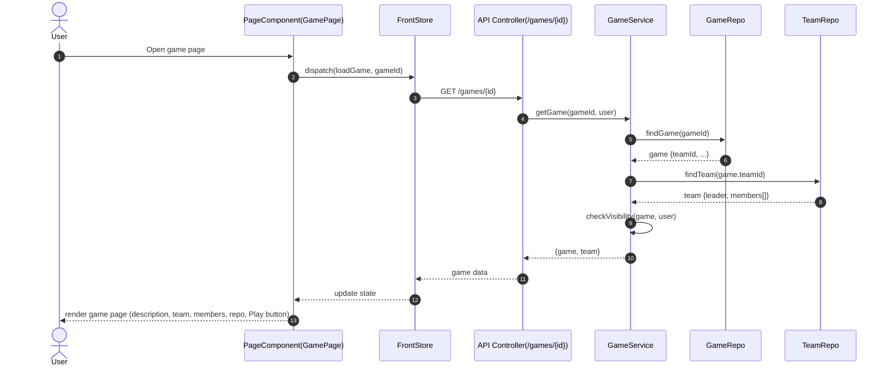

#### CTA-FP4-013 View game comments

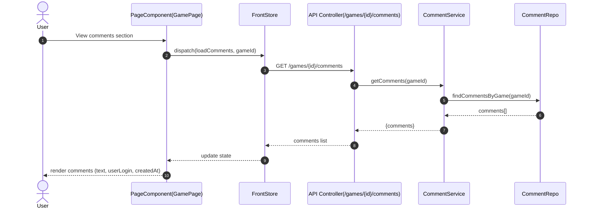

#### CTA-FP4-014 Post comment on game

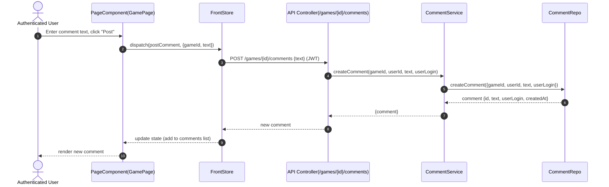

#### CTA-FP4-015 Play game (open modal)

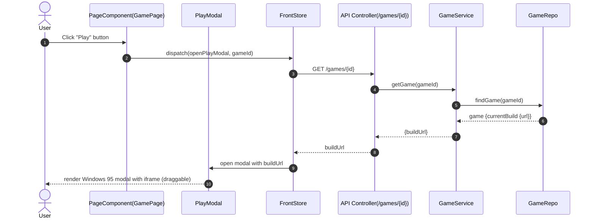

#### CTA-FP4-016 Create new team

```mermaid
sequenceDiagram
  autonumber
  actor U as Authenticated User
  participant P as PageComponent(TeamsPage)
  participant S as FrontStore
  participant C as API Controller(/teams)
  participant SV as TeamService
  participant R as TeamRepo

  U->>P: Click "Create Team", enter name
  P->>S: dispatch(createTeam, {name})
  S->>C: POST /teams {name} (JWT)
  C->>SV: createTeam(name, userId)
  SV->>R: createTeam({name, leader: userId, members: [userId]})
  R-->>SV: team {id, name, leader, members}
  SV-->>C: {team}
  C-->>S: new team
  S-->>P: update state (add to teams list)
  P-->>U: render new team
```

#### CTA-FP4-017 Add user to team

```mermaid
sequenceDiagram
  autonumber
  actor L as Team Leader
  participant P as PageComponent(TeamsPage)
  participant S as FrontStore
  participant C as API Controller(/teams/{id}/members)
  participant SV as TeamService
  participant R as TeamRepo
  participant UR as UserRepo

  L->>P: Enter userId, click "Add Member"
  P->>S: dispatch(addMember, {teamId, userId})
  S->>C: POST /teams/{id}/members {userId} (JWT)
  C->>SV: addMember(teamId, userId, currentUserId)
  SV->>R: findTeam(teamId)
  R-->>SV: team {leader}
  SV->>SV: validateLeader(currentUserId, team.leader)
  SV->>UR: findUser(userId)
  UR-->>SV: user
  SV->>R: addMemberToTeam(teamId, userId)
  R-->>SV: updated team
  SV-->>C: {team}
  C-->>S: updated team
  S-->>P: update state
  P-->>L: render updated team members
```

#### CTA-FP4-019 Create new game

```mermaid
sequenceDiagram
  autonumber
  actor U as Team Member
  participant P as PageComponent(EditorPage)
  participant S as FrontStore
  participant C as API Controller(/games)
  participant SV as GameService
  participant R as GameRepo
  participant TR as TeamRepo

  U->>P: Fill game form, click "Create"
  P->>S: dispatch(createGame, {teamId, title, ...})
  S->>C: POST /games {teamId, title, ...} (JWT)
  C->>SV: createGame(gameData, userId)
  SV->>TR: findTeam(gameData.teamId)
  TR-->>SV: team {members[]}
  SV->>SV: validateMembership(userId, team.members)
  SV->>R: createGame({teamId, title, status: "editing", ...})
  R-->>SV: game {id, ...}
  SV-->>C: {game}
  C-->>S: new game
  S-->>P: update state, navigate to editor
  P-->>U: render game editor
```

#### CTA-FP4-025 Super admin force status change

```mermaid
sequenceDiagram
  autonumber
  actor A as Super Admin
  participant P as PageComponent(EditorPage)
  participant S as FrontStore
  participant C as API Controller(/games/{id}/status)
  participant SV as GameService
  participant R as GameRepo

  A->>P: Select status, enter remark (optional), click "Force Change"
  P->>S: dispatch(forceStatusChange, {gameId, status, remark?})
  S->>C: POST /games/{id}/status {status, remark?} (JWT, isSuperAdmin)
  C->>SV: forceStatusChange(gameId, status, remark, userId)
  SV->>SV: validateSuperAdmin(userId)
  SV->>R: updateGameStatus(gameId, status, remark)
  R-->>SV: updated game
  SV-->>C: {game}
  C-->>S: updated game
  S-->>P: update state
  P-->>A: render updated status and remark
```

### System Interaction Overview (FP4)

```mermaid
flowchart TB
  subgraph Frontend
    CP[CatalogPage]
    GP[GamePage]
    EP[EditorPage]
    TP[TeamsPage]
    AM[AuthModal]
    PM[PlayModal]
    H[Header]
    FS[FrontStore]
  end
  subgraph Backend
    AUTH[Auth Controller]
    GAMES[Games Controller]
    TEAMS[Teams Controller]
    COMMENTS[Comments Controller]
    ASVC[AuthService]
    GSVC[GameService]
    TSVC[TeamService]
    CSVC[CommentService]
    REPO[Repos: User/Game/Team/Comment]
    MDB[(MongoDB)]
  end
  EXT1[Email Service]
  EXT2[S3 Storage]

  H --> AM --> FS --> AUTH --> ASVC --> REPO --> MDB
  CP --> FS --> GAMES --> GSVC --> REPO --> MDB
  GP --> PM
  GP --> FS --> GAMES
  GP --> FS --> COMMENTS --> CSVC --> REPO --> MDB
  EP --> FS --> GAMES
  EP --> FS --> GAMES --> GSVC --> EXT2
  TP --> FS --> TEAMS --> TSVC --> REPO --> MDB
  ASVC --> EXT1
  GSVC --> EXT2
```

## Impact Analysis (Change Request CR-FP4-20260109-02)

| Change ID | CTA_ID | Files.front | Files.back | Tests.toCreateOrUpdate |
|-----------|--------|-------------|------------|------------------------|
| CR-20260109-02-01 | CTA-FP4-005 | ["src/App.tsx", "src/components/Header.tsx"] | [] | ["front/__tests__/fp4/toolbar.login.test.tsx"] |
| CR-20260109-02-02 | CTA-FP4-007 | ["src/App.tsx"] | [] | ["front/__tests__/fp4/catalog.search.test.tsx"] |
| CR-20260109-02-03 | CTA-FP4-007 | ["src/App.tsx"] | [] | ["front/__tests__/fp4/catalog.search.test.tsx"] |
| CR-20260109-02-04 | CTA-FP4-014 | ["src/App.tsx"] | [] | ["front/__tests__/fp4/comments.input.test.tsx"] |
| CR-20260109-02-05 | CTA-FP4-015 | ["src/components/PlayModal.tsx"] | [] | ["front/__tests__/fp4/play.launch.test.tsx"] |
| CR-20260109-02-06 | CTA-FP4-015 | ["src/components/PlayModal.tsx"] | [] | ["front/__tests__/fp4/play.fullscreen.test.tsx"] |
| CR-20260109-02-07 | - | ["src/App.tsx", "src/contexts/WindowPositionContext.tsx"] | [] | ["front/__tests__/fp4/window.position.test.tsx"] |
| CR-20260109-02-08 | CTA-FP4-010 | ["src/App.tsx"] | [] | ["front/__tests__/fp4/teams.card.test.tsx"] |
| CR-20260109-02-09 | CTA-FP4-017, CTA-FP4-018 | ["src/App.tsx"] | [] | ["front/__tests__/fp4/teams.info.test.tsx"] |
| CR-20260109-02-10 | CTA-FP4-019 | ["src/App.tsx"] | [] | ["front/__tests__/fp4/editor.create.test.tsx"] |
| CR-20260109-02-11 | CTA-FP4-021 | ["src/App.tsx"] | [] | ["front/__tests__/fp4/game.edit.button.test.tsx"] |
| CR-20260109-02-12 | CTA-FP4-010 | ["src/App.tsx"] | [] | ["front/__tests__/fp4/teams.access.test.tsx"] |
| CR-20260109-02-13 | CTA-FP4-001, CTA-FP4-002 | ["src/components/AuthModal.tsx", "src/components/win95/Win95Modal.tsx"] | [] | ["front/__tests__/fp4/auth.modal.size.test.tsx"] |

## Impact Analysis (Change Request CR-FP4-20260109-01)

| Change ID | CTA_ID | Files.front | Files.back | Tests.toCreateOrUpdate |
|-----------|--------|-------------|------------|------------------------|
| CR-20260109-01 | CTA-FP4-007 | ["src/App.tsx"] | [] | [] |
| CR-20260109-02 | CTA-FP4-007 | ["src/App.tsx", "src/retro.css"] | [] | [] |
| CR-20260109-03 | CTA-FP4-012 | ["src/App.tsx"] | [] | [] |
| CR-20260109-04 | CTA-FP4-014 | ["src/App.tsx"] | [] | [] |
| CR-20260109-05 | - | ["src/App.tsx"] | [] | [] |
| CR-20260109-06 | - | ["src/App.tsx"] | [] | [] |
| CR-20260109-07 | CTA-FP4-005 | ["src/App.tsx", "src/components/Header.tsx"] | [] | [] |
| CR-20260109-08 | CTA-FP4-007 | ["src/App.tsx"] | [] | [] |
| CR-20260109-09 | - | ["src/App.tsx"] | [] | [] |
| CR-20260109-10 | CTA-FP4-019 | ["src/App.tsx"] | ["src/games/games.controller.ts", "src/games/games.service.ts"] | [] |
| CR-20260109-11 | CTA-FP4-022, CTA-FP4-023 | ["src/App.tsx"] | [] | [] |

## Impact Analysis (Change Request CR-FP4-20260109-03)

| Change ID | CTA_ID | Files.front | Files.back | Tests.toCreateOrUpdate |
|-----------|--------|-------------|------------|------------------------|
| CR-20260109-03-01 | CTA-FP4-017 | ["src/App.tsx"] | [] | [] |
| CR-20260109-03-02 | CTA-FP4-007, CTA-FP4-008 | ["src/App.tsx"] | [] | [] |
| CR-20260109-03-03 | CTA-FP4-011 | ["src/App.tsx"] | [] | [] |
| CR-20260109-03-04 | CTA-FP4-001, CTA-FP4-002 | ["src/components/AuthModal.tsx", "src/components/win95/Win95Modal.tsx"] | [] | [] |
| CR-20260109-03-05 | CTA-FP4-001, CTA-FP4-002 | ["src/components/AuthModal.tsx"] | [] | [] |
| CR-20260109-03-06 | CTA-FP4-010 | ["src/App.tsx", "src/components/win95/Win95Modal.tsx"] | [] | [] |
| CR-20260109-03-07 | CTA-FP4-010 | ["src/App.tsx"] | ["src/teams/teams.controller.ts", "src/teams/teams.service.ts", "src/teams/teams.module.ts"] | [] |
| CR-20260109-03-08 | CTA-FP4-019 | ["src/App.tsx"] | [] | [] |
| CR-20260109-03-09 | - | ["src/App.tsx"] | [] | [] |
| CR-20260109-03-10 | - | [] | ["src/main.ts"] | [] |
| CR-20260109-03-11 | CTA-FP4-015 | ["src/components/PlayModal.tsx"] | [] | [] |
| CR-20260109-03-12 | CTA-FP4-008 | [] | [] | [] |

## Impact Analysis (Change Request CR-FP4-20260109-04)

| Change ID | CTA_ID | Files.front | Files.back | Tests.toCreateOrUpdate |
|-----------|--------|-------------|------------|------------------------|
| CR-20260109-04-01 | CTA-FP4-015 | ["src/components/PlayModal.tsx"] | [] | [] |
| CR-20260109-04-02 | CTA-FP4-015 | ["src/components/PlayModal.tsx", "src/components/win95/Win95Modal.tsx"] | [] | [] |

## Impact Analysis (Change Request CR-FP4-20260109-05)

| Change ID | CTA_ID | Files.front | Files.back | Tests.toCreateOrUpdate |
|-----------|--------|-------------|------------|------------------------|
| CR-20260109-05-01 | - | ["src/api/client.ts"] | ["src/main.ts"] | [] |
| CR-20260109-05-02 | - | [] | ["src/main.ts"] | [] |
| CR-20260109-05-03 | - | ["src/api/client.ts"] | [] | [] |
| CR-20260109-05-04 | - | ["src/api/client.ts"] | [] | [] |
| CR-20260109-05-05 | CTA-FP4-022 | ["src/api/client.ts"] | [] | [] |

## Impact Analysis (Change Request CR-FP4-20260109-06)

| Change ID | CTA_ID | Files.front | Files.back | Tests.toCreateOrUpdate |
|-----------|--------|-------------|------------|------------------------|
| CR-20260109-06-01 | CTA-FP4-015 | [] | ["src/build-url.service.ts"] | [] |
| CR-20260109-06-02 | CTA-FP4-015 | [] | ["src/games/games.controller.ts", "src/games/games.module.ts"] | [] |

## Impact Analysis (Change Request CR-FP4-20260109-07)

| Change ID | CTA_ID | Files.front | Files.back | Tests.toCreateOrUpdate |
|-----------|--------|-------------|------------|------------------------|
| CR-20260109-07-01 | CTA-FP4-001, CTA-FP4-008 | ["src/components/win95/Win95Modal.tsx"] | [] | [] |
| CR-20260109-07-02 | CTA-FP4-015 | [] | ["src/build-url.service.ts"] | [] |
| CR-20260109-07-03 | CTA-FP4-015 | ["src/components/PlayModal.tsx", "src/components/win95/HourglassLoader.tsx"] | [] | [] |
| CR-20260109-07-04 | CTA-FP4-008 | ["src/components/win95/Win95Modal.tsx"] | [] | [] |
| CR-20260109-07-05 | CTA-FP4-016 | ["src/App.tsx"] | [] | [] |

## Impact Analysis (Change Request CR-FP4-20260109-08)

| Change ID | CTA_ID | Files.front | Files.back | Tests.toCreateOrUpdate |
|-----------|--------|-------------|------------|------------------------|
| CR-20260109-08-01 | CTA-FP4-016 | ["src/App.tsx"] | [] | [] |
| CR-20260109-08-02 | CTA-FP4-015 | ["src/App.tsx", "src/components/win95/HourglassLoader.tsx"] | ["src/build-url.service.ts", "src/games/games.controller.ts"] | [] |
| CR-20260109-08-03 | CTA-FP4-015 | ["src/App.tsx"] | [] | [] |

## Impact Analysis (Change Request CR-FP4-20260109-09)

| Change ID | CTA_ID | Files.front | Files.back | Tests.toCreateOrUpdate |
|-----------|--------|-------------|------------|------------------------|
| CR-20260109-09-01 | CTA-FP4-016 | [] | ["src/games/games.controller.ts"] | [] |
| CR-20260109-09-02 | CTA-FP4-016 | [] | ["src/games/games.repository.ts"] | [] |
| CR-20260109-09-03 | CTA-FP4-016 | [] | ["src/build-url.service.ts", "src/games/games.controller.ts"] | [] |
| CR-20260109-09-04 | CTA-FP4-016 | ["src/App.tsx"] | [] | [] |
| CR-20260109-09-05 | CTA-FP4-016 | ["src/App.tsx"] | [] | [] |
