# UX Map

## FP1: Browse & Play + Admin Authoring

### CTA table

| CTA_ID | CTA | Page | Endpoint(s) | State keys | mock_status |
| --- | --- | --- | --- | --- | --- |
| CTA-001 | Browse catalog | CatalogPage (/) | TODO: GET /games?tag=...&sort=... | ui.loading, ui.empty, ui.error, games.list, games.filters | unknown |
| CTA-002 | Filter/sort by tags | CatalogPage (/) | TODO: GET /tags (optional, derived from games tags); GET /games?tag=... | ui.loading, ui.empty, ui.error, tags.list, games.filters | unknown |
| CTA-003 | Open game page | GamePage (/games/:gameId) | TODO: GET /games/{id} | ui.loading, ui.error, game.current | unknown |
| CTA-004 | Play web build in browser | GamePage (/games/:gameId) | TODO: GET /games/{id} (includes description_md, repo_url, cover_url, tags_user, tags_system, status, build_url/build_id) | ui.loading, ui.error, build.url | unknown |
| CTA-005 | Admin create team | AdminTeamsPage (/admin/teams) | TODO: POST /admin/teams | ui.loading, ui.error, admin.teams.form | unknown |
| CTA-006 | Admin create/edit game details | AdminGameEditorPage (/admin/games/:gameId) | TODO: POST/PATCH /admin/games | ui.loading, ui.error, admin.game.form | unknown |
| CTA-007 | Admin upload build ZIP | AdminGameEditorPage (/admin/games/:gameId) | TODO: POST /admin/games/{id}/build | ui.loading, ui.error, admin.build.upload | unknown |
| CTA-008 | Admin preview build | AdminGameEditorPage (/admin/games/:gameId) | TODO: GET /games/{id} (build_url/build_id) | ui.loading, ui.error, admin.build.preview | unknown |
| CTA-009 | Admin publish game | AdminGameEditorPage (/admin/games/:gameId) | TODO: POST /admin/games/{id}/publish or /status | ui.loading, ui.error, admin.game.status | unknown |
| CTA-010 | Admin set tags on game | AdminGameEditorPage (/admin/games/:gameId) | TODO: POST/PATCH /admin/games/{id}/tags (tags_user/tags_system) | ui.loading, ui.error, admin.game.tags | unknown |
| CTA-011 | Admin change status + remark | AdminGameEditorPage (/admin/games/:gameId) | TODO: POST /admin/games/{id}/status, POST /admin/games/{id}/remarks | ui.loading, ui.error, admin.game.status | unknown |

### System Design (per CTA)

#### CTA-001 Browse catalog

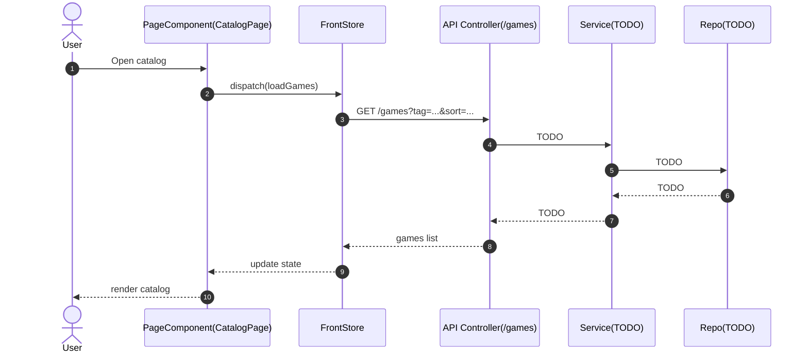

#### CTA-002 Filter/sort by tags

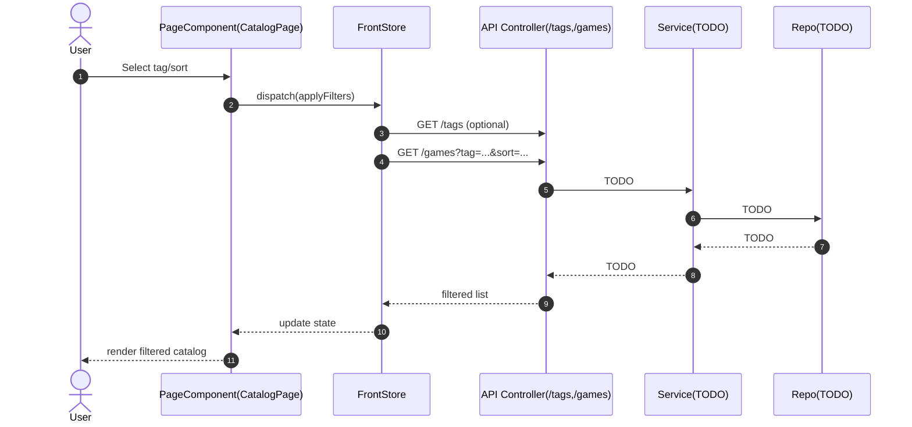

#### CTA-003 Open game page

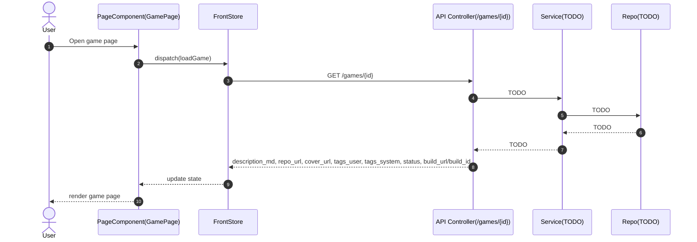

#### CTA-004 Play web build in browser

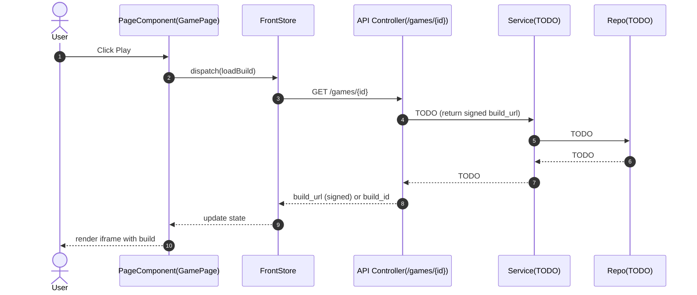

#### CTA-005 Admin create team

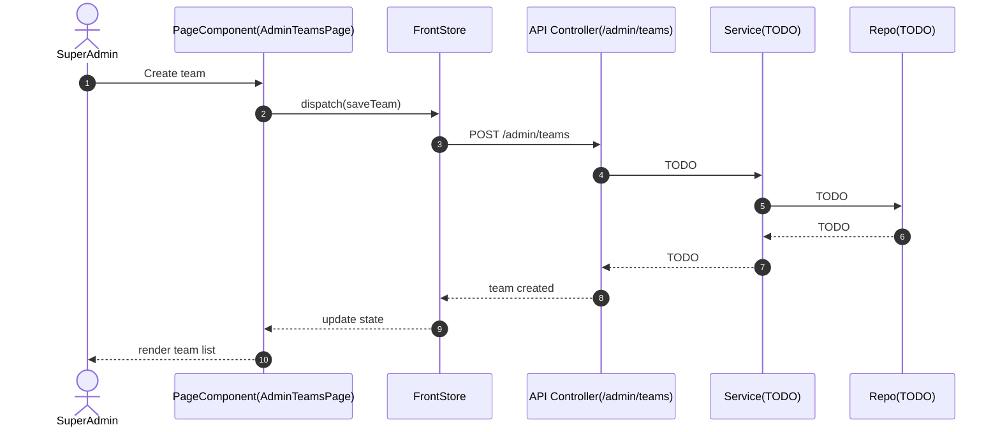

#### CTA-006 Admin create/edit game details

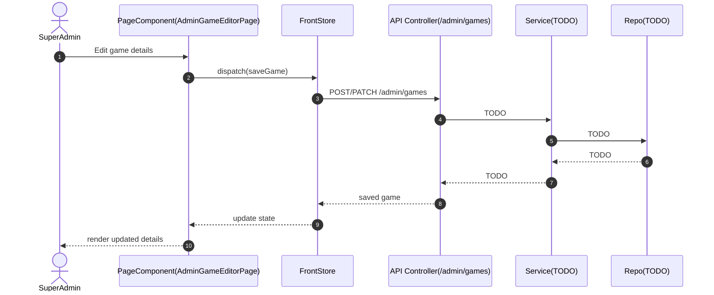

#### CTA-007 Admin upload build ZIP

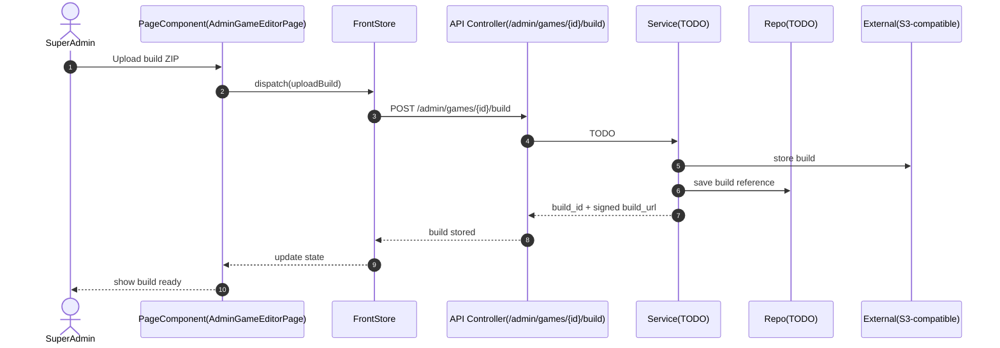

#### CTA-008 Admin preview build

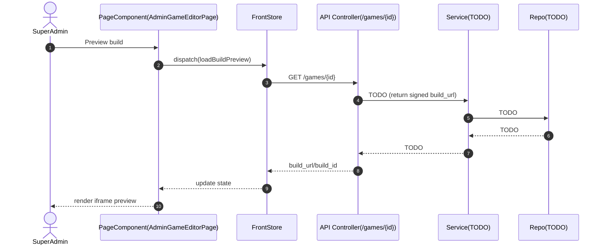

#### CTA-009 Admin publish game

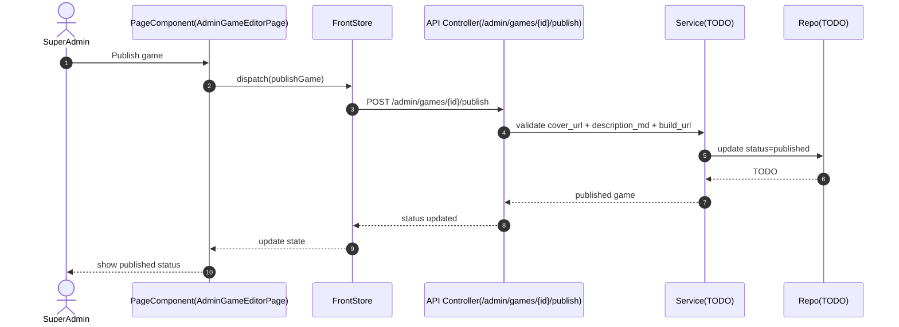

#### CTA-010 Admin set tags on game

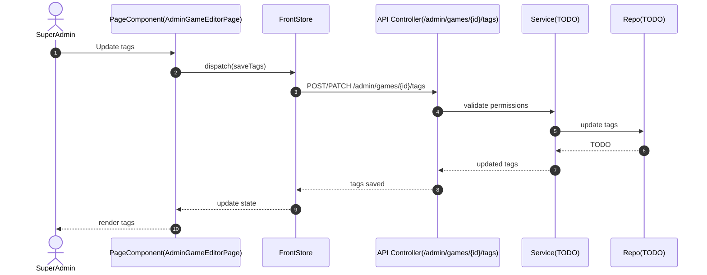

#### CTA-011 Admin change status + remark

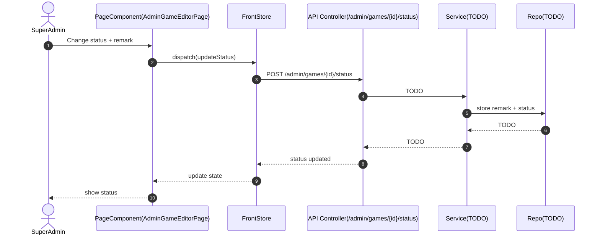

### System Interaction Overview (FP)

```mermaid
flowchart LR
  subgraph Frontend
    CP[CatalogPage]
    GP[GamePage]
    AG[AdminGameEditorPage]
    ATE[AdminTeamsPage]
    FS[FrontStore]
  end
  subgraph Backend
    CTRL[Controller: Games/Tags/Admin]
    SVC[Service: TODO]
    REPO[Repo: TODO]
    MDB[(MongoDB)]
  end
  EXT[External Storage (S3-compatible)]

  CP --> FS --> CTRL
  GP --> FS --> CTRL
  AG --> FS --> CTRL
  ATE --> FS --> CTRL
  CTRL --> SVC --> REPO --> MDB
  SVC --> EXT
```
