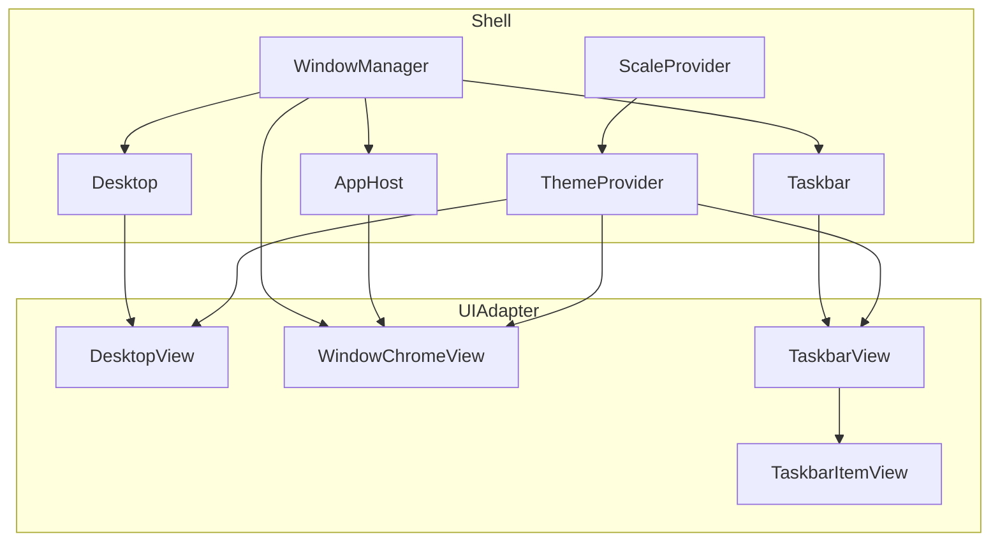
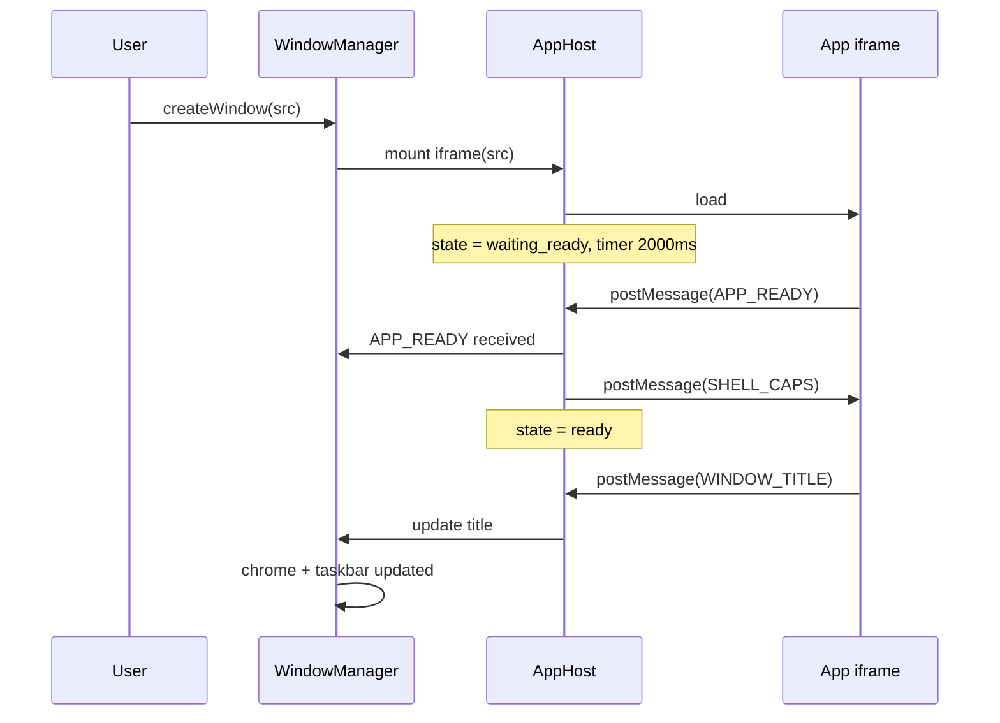
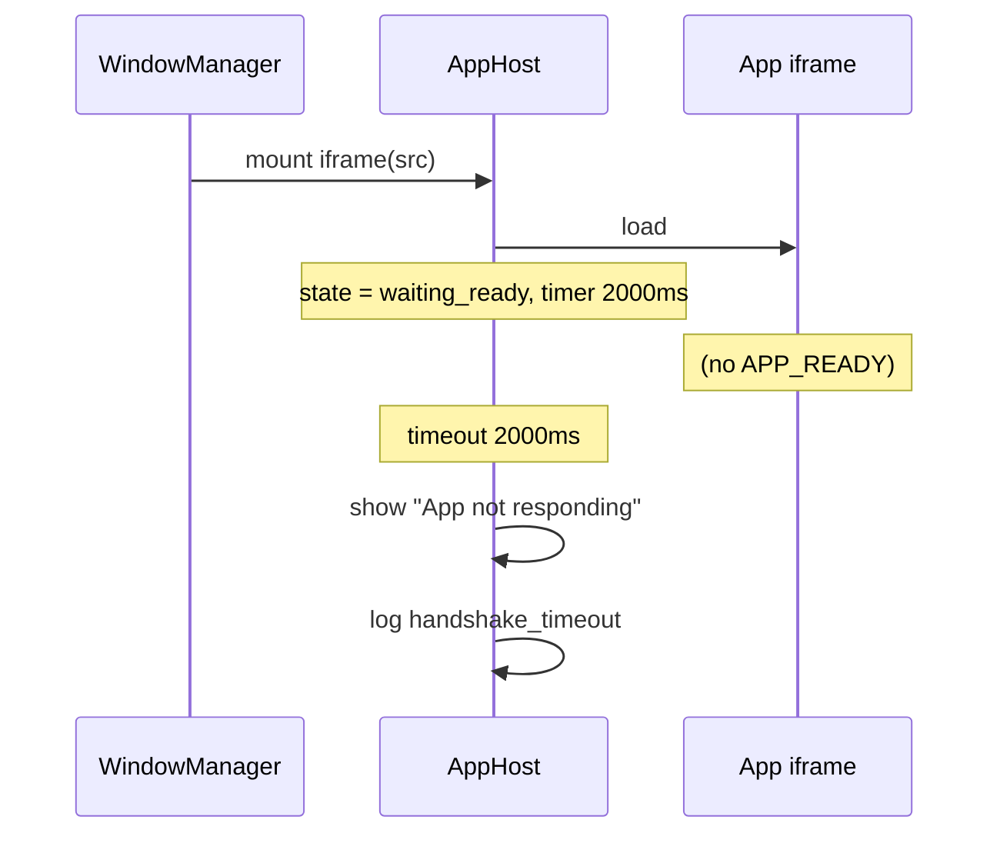
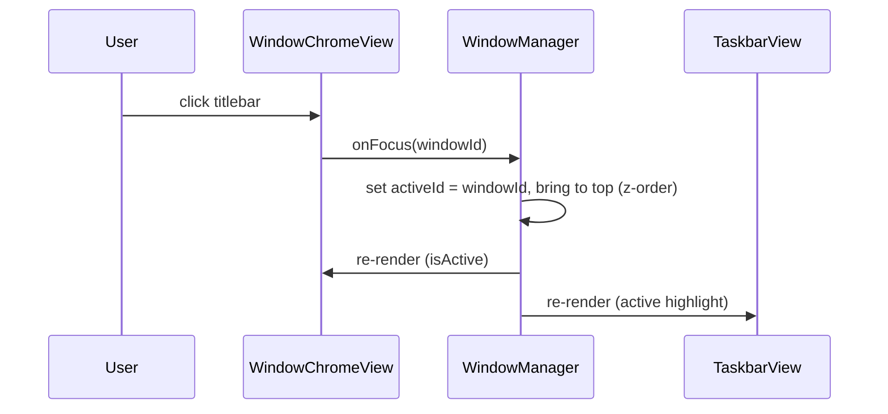
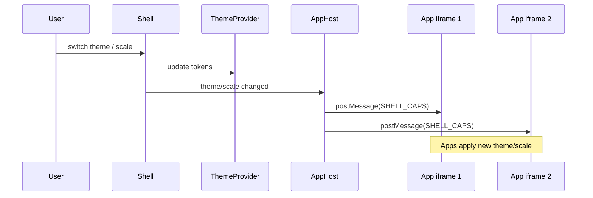
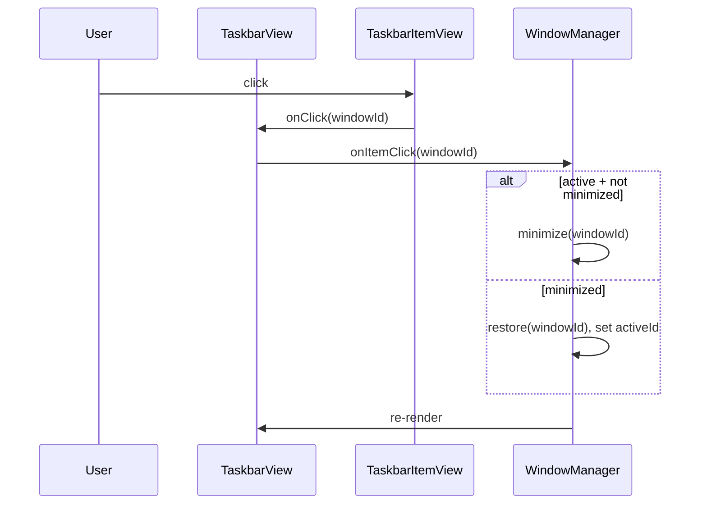

# Architecture Diagrams — Shell MVP (FP1)

**Purpose:** Component and sequence diagrams for build.  
**Scope:** FP1 only.

---

## 1. Component diagram



**ASCII alternative:**

```
+------------------+     +------------------+
|  ThemeProvider   |     |  ScaleProvider   |
+--------+---------+     +--------+---------+
         |                        |
         v                        v
+------------------+     +------------------+
|     Desktop      |<----|   WindowManager  |
+--------+---------+     +--------+---------+
         |                        |
         v                        v
+------------------+     +------------------+
|   DesktopView    |     |     Taskbar      |
+------------------+     +--------+---------+
                          |       |
                          v       v
                 +------------------+
                 |   TaskbarView    |
                 +--------+---------+
                          |
                          v
                 +------------------+
                 | TaskbarItemView  |
                 +------------------+

+------------------+
|    AppHost       |<---- WindowManager
+--------+---------+
         |
         v
+------------------+
| WindowChromeView |
+------------------+
```

---

## 2. Sequence: createWindow → handshake → WINDOW_TITLE



**Timeout path:**



---

## 3. Focus / z-order update path



---

## 4. Theme/scale switch → iframe notification

**Rule (FP1):** On theme or scale switch, Shell resends `SHELL_CAPS` to all ready iframes. No new message types (THEME_CHANGED/SCALE_CHANGED).



**Rationale:** Standalone app and app-in-Shell behave the same; single protocol path.

---

## 5. Taskbar click path



---

## References

- FP1: [docs/fps/FP1.md](../fps/FP1.md)
- PROTOCOL_v0: [docs/core/PROTOCOL_v0.md](./PROTOCOL_v0.md)
- UI_ADAPTER_v0: [docs/core/UI_ADAPTER_v0.md](./UI_ADAPTER_v0.md)
