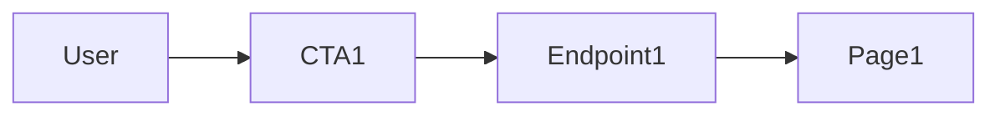

# UX Map

**Purpose:** Map user actions (CTA) to endpoints, state, and pages. Single source for design and implementation. Synced with API.yaml and MODEL.sql by ux-map-sync skill.

## Overview

| FP   | Scope summary        | Status  |
|------|----------------------|--------|
| (id) | (short description)  | plan   |

## CTA Table

| CTA        | Endpoint     | State   | Page  | Mock | Status |
|------------|--------------|---------|-------|------|--------|
| (action)   | GET /api/…   | ui.done | PageName | yes  | todo   |

- **CTA:** Call-to-action (user action).
- **Endpoint:** API used (from API.yaml).
- **State:** UI state key (e.g. ui.loading, ui.empty, ui.error).
- **Page:** Screen or view name.
- **Mock:** yes/no for mock data.
- **Status:** todo / done.

## CTA Overview (example)

Replace with your project's CTAs and diagrams.
