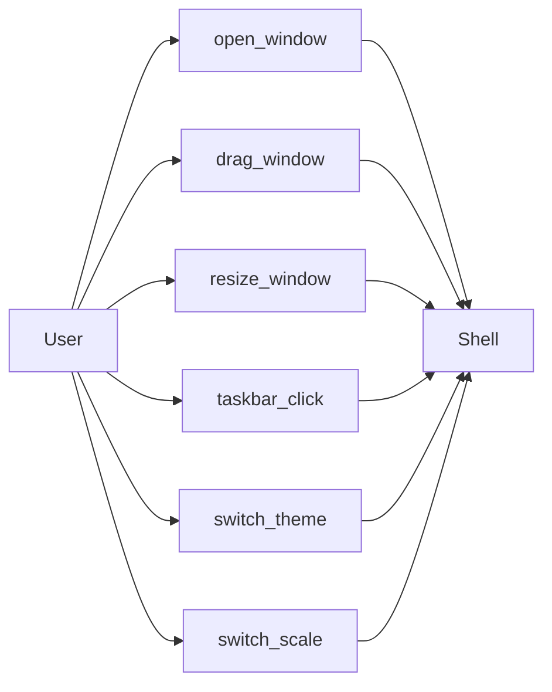

# UX Map

**Purpose:** Map user actions (CTA) to endpoints, state, and pages. Single source for design and implementation. Synced with API.yaml and MODEL.sql by ux-map-sync skill.

## Overview

| FP   | Scope summary                          | Status  |
|------|----------------------------------------|--------|
| FP1  | Shell MVP: окна + таскбар + AppHost    | plan   |

## CTA Table

| CTA         | Endpoint | State             | Page  | Mock | Status |
|-------------|----------|-------------------|-------|------|--------|
| open_window | —        | ui.window_open    | Shell | yes  | todo   |
| drag_window | —        | ui.dragging       | Shell | yes  | todo   |
| resize_window | —      | ui.resizing       | Shell | yes  | todo   |
| taskbar_click | —      | ui.focus/restore  | Shell | yes  | todo   |
| switch_theme  | —      | ui.theme_changed | Shell | yes  | todo   |
| switch_scale  | —      | ui.scale_changed | Shell | yes  | todo   |

- **CTA:** Call-to-action (user action).
- **Endpoint:** API used (from API.yaml).
- **State:** UI state key (e.g. ui.loading, ui.empty, ui.error).
- **Page:** Screen or view name.
- **Mock:** yes/no for mock data.
- **Status:** todo / done.

## CTA Overview (FP1 Shell)

