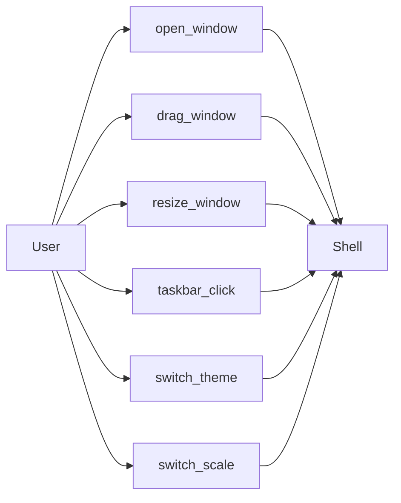

# UX Map — Manifest

**Purpose:** How to implement and integrate UX flows. Map user actions (CTA) to endpoints, state, and pages. Synced with API.yaml by ux-map-sync skill. Keep current with FP specs.

## Overview

| FP  | Scope summary                           | Status |
| --- | --------------------------------------- | ------ |
| FP1 | Shell MVP: окна + таскбар + AppHost     | plan   |
| FP3 | Explorer system app + Shell integration | plan   |

## CTA Table

| CTA              | Endpoint                    | State               | Page     | Mock | Status |
| ---------------- | --------------------------- | ------------------- | -------- | ---- | ------ |
| open_window      | —                           | ui.window_open      | Shell    | yes  | todo   |
| drag_window      | —                           | ui.dragging         | Shell    | yes  | todo   |
| resize_window    | —                           | ui.resizing         | Shell    | yes  | todo   |
| taskbar_click    | —                           | ui.focus/restore    | Shell    | yes  | todo   |
| switch_theme     | —                           | ui.theme_changed    | Shell    | yes  | todo   |
| switch_scale     | —                           | ui.scale_changed    | Shell    | yes  | todo   |
| open_my_computer | —                           | ui.explorer_open    | Shell    | yes  | todo   |
| load_roots       | GET /api/fs/roots           | ui.roots_loaded     | Explorer | yes  | todo   |
| list_dir         | GET /api/fs/list            | ui.list_loaded      | Explorer | yes  | todo   |
| open_file        | SHELL_OPEN (file)           | ui.viewer_requested | Shell    | yes  | todo   |
| run_app          | SHELL_OPEN (app)            | ui.app_requested    | Shell    | yes  | todo   |
| create_folder    | POST /api/fs/create-folder  | ui.folder_created   | Explorer | yes  | todo   |
| upload_file      | POST /api/fs/upload-file    | ui.file_uploaded    | Explorer | yes  | todo   |
| upload_zip_app   | POST /api/fs/upload-zip-app | ui.app_uploaded     | Explorer | yes  | todo   |
| delete_item      | DELETE /api/fs/delete       | ui.item_deleted     | Explorer | yes  | todo   |
| rename_item      | PUT /api/fs/rename          | ui.item_renamed     | Explorer | yes  | todo   |

- **CTA:** Call-to-action (user action).
- **Endpoint:** API used (from API.yaml).
- **State:** UI state key (e.g. ui.loading, ui.empty, ui.error).
- **Page:** Screen or view name.
- **Mock:** yes/no for mock data.
- **Status:** todo / done.

## FP3 Patchset CTA Additions

| CTA      | Endpoint | State           | Page     | Notes                           |
| -------- | -------- | --------------- | -------- | ------------------------------- |
| nav_back | —        | ui.path_changed | Explorer | History-based; client-side only |

**FP3 patchset flows:** Rename, Create folder, Delete, Upload file/zip — см. docs/fps/FP3.md § FP3 Patchset (UX flows).

---

## FP3.2 UX Delta

**Source:** docs/fps/FP3.md § FP3.2. Точные решения по 10 UX/logic дефектам.

### 1. My Computer Root View

| Rule                  | Spec                                                                               |
| --------------------- | ---------------------------------------------------------------------------------- |
| **Только диски**      | В корне "My Computer" отображаются только tiles A:, C:, D: (из GET /api/fs/roots). |
| **Без Computer tile** | Tile "My Computer" (fs-icon-my-computer) НЕ отображается в roots view.             |

### 2. Header Policy

| State                         | Header (toolbar) | Содержимое                                     |
| ----------------------------- | ---------------- | ---------------------------------------------- |
| **Root view** (mode=roots)    | Скрыт            | Нет address bar, нет back. Только grid дисков. |
| **Folder view** (mode=folder) | Показан          | Back + address bar; sticky.                    |

### 3. Sticky Header + Scroll

| Элемент              | Поведение                                                                                                                    |
| -------------------- | ---------------------------------------------------------------------------------------------------------------------------- |
| **Toolbar**          | `position: sticky; top: 0`; всегда виден при скролле.                                                                        |
| **Scroll container** | Только у grid/list tiles; `overflow-y: auto` на content area, не на root.                                                    |
| **Layout**           | Root: `display: flex; flex-direction: column`. Toolbar: `flex-shrink: 0`. Content: `flex: 1; min-height: 0; overflow: auto`. |

### 4. Back Button

| Аспект        | Spec                                             |
| ------------- | ------------------------------------------------ |
| **Визуал**    | Иконка-стрелка влево (←), не текст "Back".       |
| **States**    | disabled когда historyStack пуст; enabled иначе. |
| **Поведение** | Click → pop history, navigate to previous path.  |

### 5. Multi-Instance Explorer: State Persist

| Что хранится     | Где                                   | Условие                     |
| ---------------- | ------------------------------------- | --------------------------- |
| **currentPath**  | `state` (mode, apiPath) внутри iframe | ОБЯЗАТЕЛЬНО при focus/blur. |
| **historyStack** | Внутри iframe                         | ОБЯЗАТЕЛЬНО.                |
| **selection**    | `currentListItems`, selected index    | Опционально (P2).           |

**Правило:** Не сбрасывать state при focus/blur окна. Каждый Explorer iframe — отдельный JS context; state не должен переинициализироваться при window focus. Проверить: нет ли `window.addEventListener("focus", init)` или подобного, вызывающего reset.

---

## CTA Overview (FP3.2 Additions)

| CTA                | Endpoint              | State                 | Notes                                            |
| ------------------ | --------------------- | --------------------- | ------------------------------------------------ | ---------------------------------------- |
| (unchanged)        | delete_item           | DELETE /api/fs/delete | ui.item_deleted                                  | FP3.2: UI event wiring, send request     |
| (unchanged)        | rename_item           | PUT /api/fs/rename    | ui.item_renamed                                  | FP3.2: toPath = parent(fromPath)+newName |
| open_app_after_zip | POST /api/fs/open-url | —                     | FP3.2: первый open после zip → 200 (no 404 race) |

---

## CTA Overview (FP1 Shell)

