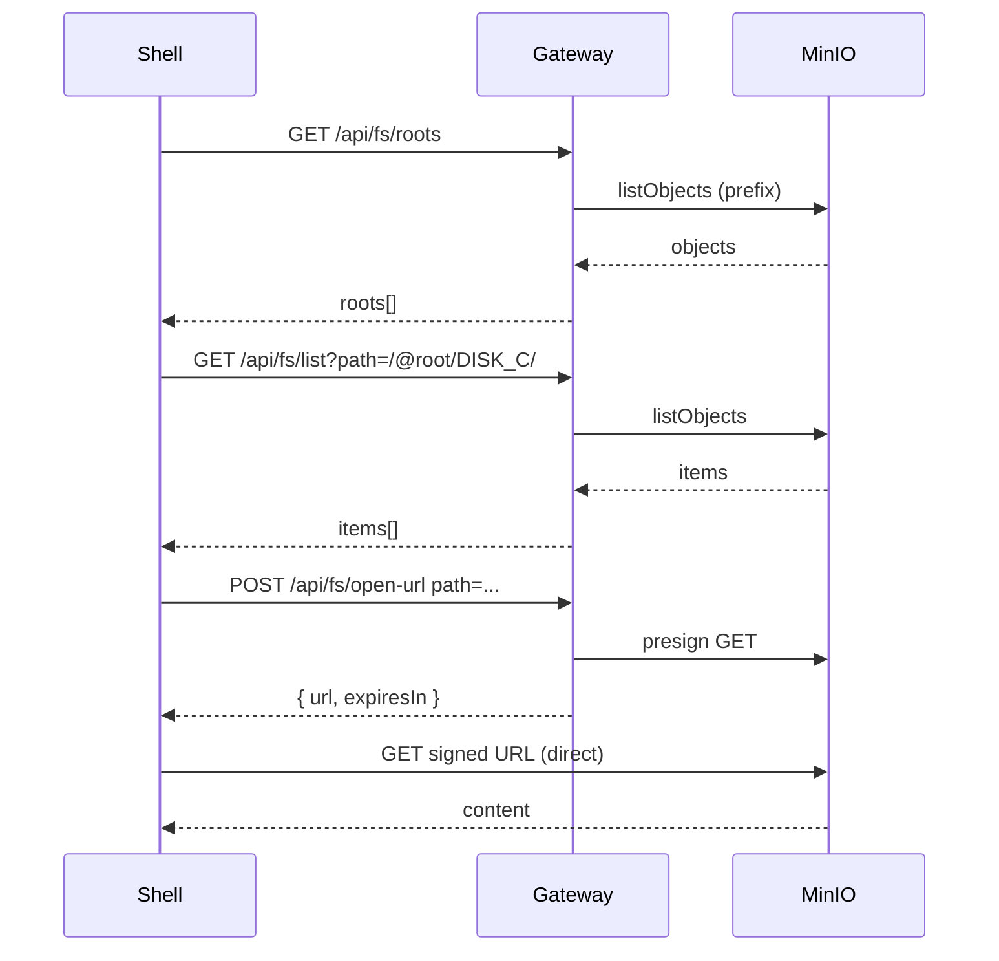

# FP2: Backend Gateway + FS Contract + Dev S3 (MinIO)

**Status:** released (internal)  
**Created:** 2025-02-19  
**Updated:** 2025-02-19

> **Context:** Shell по домену уже решён в FP1. В FP2 домен обязателен для gateway (и желательно для MinIO console), чтобы всё работало как "настоящая среда", а не "локальные порты".

## Intent Analysis

Нужен локальный S3-совместимый источник данных и серверный шлюз, который:

- даёт предсказуемый контракт файловой системы (list/stat),
- выдаёт короткоживущие ссылки на чтение объектов (open-url),
- решает CORS/headers, чтобы Shell/Apps не имели прямого доступа к S3-ключам.

## Scope

### IN — Что входит

- Gateway API по доменному имени (api.shell.local)
- FS Contract v0: list, stat, open-url, roots
- MinIO (S3) в dev через домен s3.shell.local (API и опц. console)
- Traefik routes для gateway + MinIO
- Интеграционные тесты API
- Единый error model
- Structured logging (аналитика)

### OUT — Что не входит

- Explorer App (FP3)
- Proxy-режим для контента (только signed URLs в FP2)
- Множественные buckets (single bucket + prefixes)
- Production S3 / IAM
- Запись/удаление объектов (read-only в FP2)

## Questions

| #   | Question                           | Answer                                                                                                    | Status |
| --- | ---------------------------------- | --------------------------------------------------------------------------------------------------------- | ------ |
| 1   | Proxy vs Signed URL only?          | Signed URL only (проще). Proxy — позже, если CORS/headers станут проблемой                                | closed |
| 2   | Buckets vs single bucket + prefix? | Single bucket + prefixes в dev (проще переносить), roots маппятся на prefix                               | closed |
| 3   | Path scheme формат?                | /@root/DISK_C/path/to/file.png (см. Decisions)                                                            | closed |
| 4   | TTL для signed URL?                | TTL_DEFAULT=120, TTL_MIN=60, TTL_MAX=300; env FS_SIGNED_URL_TTL_SEC                                       | closed |
| 5   | MinIO console домен?               | Console optional, не обязателен для DoD. AC A3: API via s3.shell.local обязателен; console — nice-to-have | closed |

## Decisions (ADRs)

| #   | Decision                                                         | Rationale                                                                                                                                                 | Status   |
| --- | ---------------------------------------------------------------- | --------------------------------------------------------------------------------------------------------------------------------------------------------- | -------- |
| 1   | **Signed URL only** (no proxy)                                   | Проще реализовать, меньше нагрузки на gateway. Proxy — позже, если CORS/headers станут проблемой                                                          | accepted |
| 2   | **Single bucket + prefixes**                                     | Проще переносить в prod, roots маппятся на S3 prefix. Один bucket `birdmaid-dev`, dev prefixes: `roots/DISK_C/`, `roots/APPS/` (см. infra/minio/fixtures) | accepted |
| 3   | **Path scheme:** `/@root/{ROOT_ID}/path/to/item`                 | ROOT_ID — идентификатор виртуального корня. Dev roots: DISK_C, APPS. Пример: `/@root/DISK_C/docs/readme.txt`                                              | accepted |
| 4   | **isApp discovery:** dir isApp=true если есть `{dir}/index.html` | При list dir: HEAD на `{prefix}{dir}index.html`. FP3 нужен способ понять "что запускать". Для FP2 достаточно HEAD при list (acceptable для dev)           | accepted |
| 5   | **Signed URL TTL:** TTL_DEFAULT=120, TTL_MIN=60, TTL_MAX=300     | Конфигурируемо через env `FS_SIGNED_URL_TTL_SEC`                                                                                                          | accepted |
| 6   | **MinIO console:** optional, не в DoD                            | AC A3: s3.shell.local (API) обязателен; console — nice-to-have. Иначе агенты тратят время на console                                                      | accepted |
| 7   | **Gateway runtime:** Node (Fastify/Express) + AWS SDK S3         | Быстрее интегрировать с текущим стеком (pnpm, TS), проще тестировать                                                                                      | accepted |

## Acceptance Criteria

### A. Доступ по доменному имени

| ID  | Критерий                                                                                                                              |
| --- | ------------------------------------------------------------------------------------------------------------------------------------- |
| A1  | Gateway доступен по доменному имени в dev: http://api.shell.local/ (или gateway.shell.local)                                          |
| A2  | GET http://api.shell.local/health возвращает 200 и JSON `{ status: "ok", version?, build? }`                                          |
| A3  | MinIO API доступен в dev через домен http://s3.shell.local/ (обязательно). Console http://minio.shell.local/ — nice-to-have, не в DoD |

### B. FS Contract v0

| ID  | Критерий                                                                        |
| --- | ------------------------------------------------------------------------------- | --------------------------------------------------------------------------------- |
| B1  | GET /api/fs/list?path=/ возвращает массив `items[]` с типами `dir               | file`и стабильными полями:`{ path, name, kind, size?, modified?, mime?, isApp? }` |
| B2  | GET /api/fs/stat?path=... возвращает метаданные по одному item или 404 если нет |
| B3  | Порядок и структура ответа стабильны и документированы в docs/core/API.yaml     |

**Contract Rules (path, dir, name, sort):**

| Правило        | Описание                                                                        |
| -------------- | ------------------------------------------------------------------------------- |
| path canonical | Всегда начинается с `/`; для dir всегда заканчивается `/`                       |
| name           | Не содержит `/`                                                                 |
| dir path       | `/@root/DISK_C/docs/` (trailing slash)                                          |
| file path      | `/@root/DISK_C/docs/readme.txt` (без trailing slash)                            |
| sort           | dirs сначала, потом files; внутри группы — lexicographic (стабильно для тестов) |

### C. Open URL (без ключей в браузере)

| ID  | Критерий                                                                                      |
| --- | --------------------------------------------------------------------------------------------- |
| C1  | POST /api/fs/open-url (или GET) выдаёт short-lived URL для чтения объекта по path             |
| C2  | URL ограничен по времени (60–300 сек) и подходит для ``, `<audio>`, `<video>`, fetch |
| C3  | Gateway не раскрывает S3 credentials и не требует их от клиента                               |

### D. Virtual roots (системные каталоги)

| ID  | Критерий                                                                                                    |
| --- | ----------------------------------------------------------------------------------------------------------- |
| D1  | GET /api/fs/roots возвращает виртуальные корни (например My Computer, Disk C → маппинг на S3 prefix/bucket) |
| D2  | list принимает пути вида `/@root/DISK_C/...` (или иной формат), и это описано                               |

### E. CORS / Headers

| ID  | Критерий                                                                                                                                          |
| --- | ------------------------------------------------------------------------------------------------------------------------------------------------- |
| E1  | Только Shell домены разрешены как origin (dev allowlist)                                                                                          |
| E2  | Для signed URLs: либо CORS корректно настроен на S3/MinIO, либо gateway проксирует контент (решение фиксируется) — FP2: signed URL, CORS на MinIO |

### F. Error model

| ID  | Критерий                                                                                     |
| --- | -------------------------------------------------------------------------------------------- |
| F1  | Ошибки возвращаются в едином формате: `{ error: { code, message, details? } }`               |
| F2  | 404 на несуществующий path, 400 на некорректный path, 500 на неожиданные ошибки (логируются) |

## Security & Validation (FP2)

**Path validation:**

- запрет `..`, `\`, двойных слэшей
- нормализация: `/` prefix, decode once
- max length: 1024

**Root isolation:**

- path обязан начинаться с `/@root/{ROOT_ID}/`
- ROOT_ID только из roots (иначе 403 ROOT_NOT_FOUND)

**CORS:**

- allowlist origins: `http://shell.local`, `http://api.shell.local` (и опц. https варианты)
- preflight handling

**Secrets:**

- MinIO access/secret только в gateway env / docker secrets
- Никаких ключей в фронте

**Почему:** это ядро design и тестов (400/403).

## Analytics (минимум)

Логирование на gateway (console + structured logs):

| Event            | Fields                                                         | Purpose              |
| ---------------- | -------------------------------------------------------------- | -------------------- |
| fs_list          | path, count, durationMs, status                                | Диагностика list     |
| fs_stat          | path, durationMs, status                                       | Диагностика stat     |
| fs_open_url      | path, ttlSec, durationMs, status                               | Диагностика open-url |
| fs_roots         | durationMs, status                                             | Диагностика roots    |
| request_rejected | reason: "bad_origin"\|"bad_path"\|"rate_limit", origin?, path? | Отклонённые запросы  |
| s3_error         | op, code, durationMs                                           | Ошибки S3            |

**Критерий успеха:** по логам можно понять "что сломалось" без дебага клиента.

## Definition of Done

### Документация

- [x] docs/core/API.yaml актуален: roots, list, stat, open-url, error schema
- [x] docs/dev/DEV_DOMAIN.md: домены api.shell.local, s3.shell.local, команды

### Инфра

- [x] `infra/docker-compose.dev.yml` поднимает MinIO, Gateway, Traefik
- [x] Нет ключей S3 в фронте

### Тесты

- [x] Интеграционные тесты: list, stat, open-url, CORS, validation
- [x] `pnpm test:api` — 16 tests
- [x] `pnpm test` — unit
- [x] `pnpm lint`

### Dev-domain check

- [x] `curl http://api.shell.local/health` → 200
- [x] `curl http://api.shell.local/api/fs/roots` → 200
- [x] `curl -I <signed_url>` → 200 (s3.shell.local)

### Evidence

- [x] docs/fps/FP2.md: команды, evidence, status ready for FP3

## Requirements

### Use Cases

**Main Flow:**

1. Shell/App запрашивает roots → получает список виртуальных корней
2. list /@root/DISK_C/ → получает items (dir/file)
3. stat /@root/DISK_C/docs/readme.txt → метаданные
4. open-url /@root/DISK_C/docs/readme.txt → signed URL, клиент загружает через ``/fetch

**Alternate Flows:**

- list подкаталога
- stat директории

**Error Flows:**

- 404 на несуществующий path
- 400 на некорректный path (например, path traversal)
- 500 + логирование на S3/MinIO ошибки
- request_rejected при bad_origin

### Business Rules

- Path scheme: `/@root/{ROOT_ID}/...` — ROOT_ID из roots
- Single bucket, prefixes для roots
- Signed URL TTL: TTL_DEFAULT=120, TTL_MIN=60, TTL_MAX=300; env `FS_SIGNED_URL_TTL_SEC`
- CORS: только allowlist origins (shell.local, api.shell.local в dev)
- isApp: dir имеет isApp=true если есть `{dir}/index.html` (HEAD при list)

## UX Map

| CTA        | Endpoint                  | State           | Page           | Mock | Status |
| ---------- | ------------------------- | --------------- | -------------- | ---- | ------ |
| load_roots | GET /api/fs/roots         | ui.roots_loaded | Explorer (FP3) | yes  | todo   |
| list_dir   | GET /api/fs/list?path=... | ui.list_loaded  | Explorer (FP3) | yes  | todo   |
| stat_item  | GET /api/fs/stat?path=... | ui.stat_loaded  | Explorer (FP3) | yes  | todo   |
| open_file  | POST /api/fs/open-url     | ui.url_ready    | Explorer (FP3) | yes  | todo   |

## Architecture

### Components

- **Gateway:** Node (Fastify/Express), endpoints /api/fs/\*, /health, CORS middleware, AWS SDK S3 client
- **MinIO:** S3-compatible storage, dev fixture bucket + prefixes
- **Traefik:** Routes api.shell.local → gateway, s3.shell.local → MinIO

### Diagrams



## Tests

### UAT/BDD

- [ ] UAT 1: `curl http://api.shell.local/health` → 200
- [ ] UAT 2: `curl http://api.shell.local/api/fs/roots` → roots[]
- [ ] UAT 3: `curl http://api.shell.local/api/fs/list?path=/@root/DISK_C/` → items[]
- [ ] UAT 4: `curl http://api.shell.local/api/fs/stat?path=/@root/DISK_C/known-file.txt` → 200
- [ ] UAT 5: POST /api/fs/open-url → signed_url; `curl -I <signed_url>` → 200 (URL к s3.shell.local)
- [ ] UAT 6: Request с bad origin → 403 / request_rejected

### Test Files

- Integration: `back/__tests__/fp2/api-fs.test.ts` (или аналог)
- Fixtures: sample S3 layout в `fixtures/s3-sample/` или MinIO init script

### Coverage

- Gateway endpoints: целевой минимум

## Plan / Milestones

| M   | Milestone                     | Tasks                                             | Status |
| --- | ----------------------------- | ------------------------------------------------- | ------ |
| M1  | Gateway skeleton + dev-domain | /health, CORS, error model, api.shell.local → 200 | done   |
| M2  | TESTS-RED                     | Integration tests scaffold, падают                | done   |
| M3  | roots/list/stat               | Path validation, S3 client, roots, list, stat     | done   |
| M4  | open-url + CORS               | Presigned URLs, TTL, CORS verification            | done   |
| M5  | TESTS-GREEN + analytics       | Tests pass, structured logs                       | done   |
| M6  | MinIO + fixture               | (уже в compose)                                   | done   |
| M7  | Release gate                  | DoD checklist, evidence                           | done   |

## Risks

| Risk                            | Probability | Impact | Mitigation                                           | Status    |
| ------------------------------- | ----------- | ------ | ---------------------------------------------------- | --------- |
| MinIO CORS для signed URLs      | medium      | medium | Настроить CORS на MinIO или перейти на proxy в FP2.1 | open      |
| Path traversal                  | low         | high   | Валидация path, запрет `..`                          | open      |
| TTL signed URL слишком короткий | low         | low    | FS_SIGNED_URL_TTL_SEC, TTL_DEFAULT=120 (ADR#5)       | mitigated |

## Dependencies

- FP1 (shell.local, Traefik) — done
- MinIO image
- Gateway: Node (Fastify/Express) + AWS SDK S3 (ADR#7)

## Design Deliverables (mode=design)

| Артефакт     | Путь                          | Описание                                     |
| ------------ | ----------------------------- | -------------------------------------------- |
| API contract | docs/core/API.yaml            | Endpoints, schemas, error model              |
| FS contract  | docs/core/FS_CONTRACT_v0.md   | Path scheme, rules, examples                 |
| CORS         | docs/core/CORS_SIGNED_URLS.md | MinIO CORS для signed URLs                   |
| Tests plan   | docs/tests/FP2_TESTS.md       | AC → test mapping                            |
| Dev domain   | docs/dev/DEV_DOMAIN.md        | Hosts, commands, health checks               |
| MinIO infra  | infra/minio/                  | cors.json, init.sh, fixtures, README         |
| Compose      | infra/docker-compose.dev.yml  | Canonical compose (minio + gateway + routes) |

**Runtime:** Реализация gateway (Node + Fastify + AWS SDK) — в **mode=build**, не в design. Design = contracts + infra plan + tests plan.

## Artifacts

- Coverage: `artifacts/FP2/.../coverage/...`
- Logs: gateway structured logs
- Evidence: `docs/fps/FP2.md` (commands, fixtures link, status)

## Что дальше делать (пошагово)

1. **Создать docs/fps/FP2.md** — done (этот файл)
2. **Принять decisions** — done (signed-url, bucket+prefix, path scheme, TTL, isApp, runtime)
3. **Поднять dev-домены** для gateway+minio через Traefik (api.shell.local, s3.shell.local)
4. **TESTS-RED** — интеграционные тесты scaffold (падают)
5. **Реализовать gateway endpoints** — roots, list, stat, open-url
6. **TESTS-GREEN** — только после зелёных тестов переходить в FP3 (Explorer)

## Evidence

### M1 (Gateway skeleton + dev-domain) — DONE

- **Команды запуска:** `docker compose -f infra/docker-compose.dev.yml up -d`
- **Health check:** `curl http://api.shell.local/health` → 200, `{ "status": "ok" }`
- **CORS allowlist:** `http://shell.local`, `http://api.shell.local`, `http://localhost:5173`; bad origin → 403
- **Gateway:** `back/` (Node + Fastify), volume mount в compose, без Dockerfile.gateway
- **Локальный запуск (опц.):** `cd back && pnpm dev` → http://localhost:3000/health

### M2 (TESTS-RED) — DONE

- **Команда тестов:** `pnpm test:api`
- **Prerequisite:** `docker compose -f infra/docker-compose.dev.yml up -d` (api.shell.local, s3.shell.local)
- **Fixtures:** MinIO init загружает DISK_C, APPS (minio-init в compose)
- **Тесты:** `back/__tests__/fp2/api-fs.integration.test.ts` — health (pass), roots/list/stat/open-url/errors/CORS (fail до M5)
- **Runner:** vitest, config `vitest.api.config.ts`
- **Домены:** тесты используют api.shell.local, s3.shell.local (не localhost порты)

### M3 (roots/list/stat) — DONE

- **roots:** GET /api/fs/roots → 200, `{ roots: [{ id, label }] }` (DISK_C, APPS)
- **list:** GET /api/fs/list?path=/@root/DISK_C/ → 200, `{ items: [...] }` (dirs first, lexicographic, isApp HEAD)
- **stat:** GET /api/fs/stat?path=... → 200 или 404
- **Validation:** bad path → 400 BAD_PATH, bad root → 403 ROOT_NOT_FOUND, missing → 404 NOT_FOUND
- **Path module:** `back/src/path.ts` (canonicalize, reject .. \ //, root isolation)
- **FS module:** `back/src/fs.ts` (S3 ListObjectsV2, HeadObject, mime inference)
- **S3 client:** @aws-sdk/client-s3, credentials из env (FS*S3*\*)

### M4 (open-url + CORS) — DONE

- **open-url:** POST /api/fs/open-url `{ path, ttlSec? }` → `{ url, expiresIn }`
- **TTL:** default 120, min 60, max 300; env `FS_SIGNED_URL_TTL_SEC`; ttlSec clamped
- **Signed URL:** points to s3.shell.local (FS_S3_PUBLIC_URL in compose)
- **CORS:** MinIO cors.json applied via minio-init (`mc cors set`); allowlist: shell.local, api.shell.local, localhost:5173
- **Verification (curl):**
  ```bash
  SIGNED_URL=$(curl -s -X POST http://api.shell.local/api/fs/open-url -H "Content-Type: application/json" -d '{"path":"/@root/DISK_C/readme.txt"}' | jq -r .url)
  curl -I "$SIGNED_URL" -H "Origin: http://shell.local"
  # Expect: 200, Access-Control-Allow-Origin: http://shell.local
  ```
- **Browser check:** Open shell.local, load asset via signed URL; DevTools Network → 200 from s3.shell.local with CORS headers

### M5 (TESTS-GREEN + analytics) — DONE

- **Tests:** `pnpm test` (unit), `pnpm test:api` (integration, prerequisite: compose up)
- **Lint:** `pnpm lint`
- **Analytics events:** fs_roots, fs_list, fs_stat, fs_open_url (path, count/durationMs, status); request_rejected (reason: bad_origin|bad_path|bad_root); s3_error (op, code, durationMs)
- **Commands:**
  ```bash
  docker compose -f infra/docker-compose.dev.yml up -d
  pnpm test:api   # 16 tests
  pnpm test       # unit
  pnpm lint
  ```

### M6 (Release gate) — DONE

- **Gate decision:** PASS
- **Security sanity:** CORS allowlist (gateway + MinIO), path validation + root isolation (tests), secrets only in gateway env
- **No git tags** created (internal release)

### Status

- [x] pnpm test:api — PASS (при запущенном compose)
- [x] pnpm test — PASS
- [x] pnpm lint — PASS
- **Ready for FP3**

---

## Release Gate

| Check                     | Result                                                             |
| ------------------------- | ------------------------------------------------------------------ |
| Security: CORS allowlist  | PASS — gateway + MinIO cors.json соответствуют CORS_SIGNED_URLS.md |
| Security: path validation | PASS — тесты bad path 400, bad root 403                            |
| Security: secrets         | PASS — MinIO credentials только в compose/gateway env, не в front  |
| DoD checklist             | PASS — все пункты выполнены                                        |
| Evidence                  | PASS — команды, fixtures, status                                   |

**Gate decision: PASS**

---

## FP3 Handoff

**FP3 (Explorer) will consume:**

| Contract         | Source                | Usage                                                                                      |
| ---------------- | --------------------- | ------------------------------------------------------------------------------------------ |
| **roots**        | GET /api/fs/roots     | Список виртуальных корней (DISK_C, APPS)                                                   |
| **path scheme**  | /@root/{ROOT_ID}/path | Canonical paths; dirs end with `/`                                                         |
| **FsItem**       | list/stat response    | `{ path, name, kind, size?, modified?, mime?, isApp? }`                                    |
| **isApp**        | dir.isApp             | true если `{dir}/index.html` существует; для запуска App                                   |
| **open-url**     | POST /api/fs/open-url | `{ path, ttlSec? }` → `{ url, expiresIn }`; использовать url для ``, `<video>`, fetch |
| **Error schema** | 400/403/404/500       | `{ error: { code, message, details? } }`                                                   |

**Base URL:** `http://api.shell.local` (dev-domain)

---

## FP2 Freeze Index

**A) Scope summary:** Gateway API (api.shell.local), FS Contract v0 (list, stat, open-url, roots), MinIO via s3.shell.local, Traefik routes, integration tests, error model, structured logging. Read-only, signed URLs, single bucket + prefixes.

**B) Code evidence (paths):**

- back/src/index.ts
- back/src/fs.ts
- back/src/path.ts
- back/**tests**/fp2/api-fs.integration.test.ts
- vitest.api.config.ts
- infra/docker-compose.dev.yml
- infra/minio/init.sh
- infra/minio/cors.json
- infra/minio/fixtures/\*\*

**C) Spec/design artifacts (paths):**

- docs/core/API.yaml
- docs/core/FS_CONTRACT_v0.md
- docs/core/CORS_SIGNED_URLS.md
- docs/tests/FP2_TESTS.md
- docs/dev/DEV_DOMAIN.md
- docs/audit/FP2_AUDIT_REPORT.md

**D) Archive link:**

- [archive/FP2/README.md](../../archive/FP2/README.md) (описание состава)
- archive/FP2/transcripts/\* (design/build transcripts)

**E) Gate Commands (canonical):**

| Command                  | Expected exit   | E2E in DoD |
| ------------------------ | --------------- | ---------- |
| `git status --porcelain` | 0 (empty)       | —          |
| `./infra/smoke.sh`       | 0 (PLATFORM OK) | —          |
| `./infra/test-lint.sh`   | 0               | —          |
| `./infra/test-api.sh`    | 0               | **no**     |

**Canonical (container):** `./infra/gate.sh FP2`. Host-only: `git status`, `./infra/smoke.sh`. Host `pnpm lint/test/etc` prohibited for gate. Prerequisite: `docker compose -f infra/docker-compose.dev.yml up -d`.

**F) Known caveats:**

- Host `pnpm install` may fail (EACCES) — canonical verification uses container. See [docs/dev/GUARDRAILS.md](../dev/GUARDRAILS.md).
