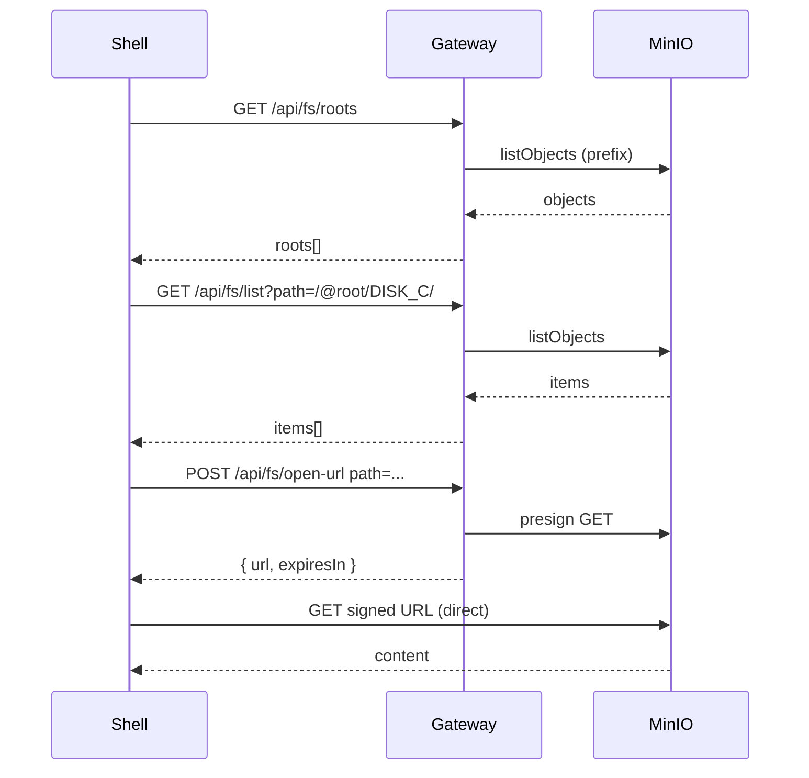

# FP2: Backend Gateway + FS Contract + Dev S3 (MinIO)

**Status:** design  
**Created:** 2025-02-19  
**Updated:** 2025-02-19

> **Context:** Shell по домену уже решён в FP1. В FP2 домен обязателен для gateway (и желательно для MinIO console), чтобы всё работало как "настоящая среда", а не "локальные порты".

## Intent Analysis

Нужен локальный S3-совместимый источник данных и серверный шлюз, который:

- даёт предсказуемый контракт файловой системы (list/stat),
- выдаёт короткоживущие ссылки на чтение объектов (open-url),
- решает CORS/headers, чтобы Shell/Apps не имели прямого доступа к S3-ключам.

## Scope

### IN — Что входит

- Gateway API по доменному имени (api.shell.local)
- FS Contract v0: list, stat, open-url, roots
- MinIO (S3) в dev через домен s3.shell.local (API и опц. console)
- Traefik routes для gateway + MinIO
- Интеграционные тесты API
- Единый error model
- Structured logging (аналитика)

### OUT — Что не входит

- Explorer App (FP3)
- Proxy-режим для контента (только signed URLs в FP2)
- Множественные buckets (single bucket + prefixes)
- Production S3 / IAM
- Запись/удаление объектов (read-only в FP2)

## Questions

| # | Question | Answer | Status |
|---|----------|--------|--------|
| 1 | Proxy vs Signed URL only? | Signed URL only (проще). Proxy — позже, если CORS/headers станут проблемой | closed |
| 2 | Buckets vs single bucket + prefix? | Single bucket + prefixes в dev (проще переносить), roots маппятся на prefix | closed |
| 3 | Path scheme формат? | /@root/DISK_C/path/to/file.png (см. Decisions) | closed |
| 4 | TTL для signed URL? | TTL_DEFAULT=120, TTL_MIN=60, TTL_MAX=300; env FS_SIGNED_URL_TTL_SEC | closed |
| 5 | MinIO console домен? | Console optional, не обязателен для DoD. AC A3: API via s3.shell.local обязателен; console — nice-to-have | closed |

## Decisions (ADRs)

| # | Decision | Rationale | Status |
|---|----------|-----------|--------|
| 1 | **Signed URL only** (no proxy) | Проще реализовать, меньше нагрузки на gateway. Proxy — позже, если CORS/headers станут проблемой | accepted |
| 2 | **Single bucket + prefixes** | Проще переносить в prod, roots маппятся на S3 prefix. Один bucket `birdmaid-dev`, dev prefixes: `roots/DISK_C/`, `roots/APPS/` (см. infra/minio/fixtures) | accepted |
| 3 | **Path scheme:** `/@root/{ROOT_ID}/path/to/item` | ROOT_ID — идентификатор виртуального корня. Dev roots: DISK_C, APPS. Пример: `/@root/DISK_C/docs/readme.txt` | accepted |
| 4 | **isApp discovery:** dir isApp=true если есть `{dir}/index.html` | При list dir: HEAD на `{prefix}{dir}index.html`. FP3 нужен способ понять "что запускать". Для FP2 достаточно HEAD при list (acceptable для dev) | accepted |
| 5 | **Signed URL TTL:** TTL_DEFAULT=120, TTL_MIN=60, TTL_MAX=300 | Конфигурируемо через env `FS_SIGNED_URL_TTL_SEC` | accepted |
| 6 | **MinIO console:** optional, не в DoD | AC A3: s3.shell.local (API) обязателен; console — nice-to-have. Иначе агенты тратят время на console | accepted |
| 7 | **Gateway runtime:** Node (Fastify/Express) + AWS SDK S3 | Быстрее интегрировать с текущим стеком (pnpm, TS), проще тестировать | accepted |

## Acceptance Criteria

### A. Доступ по доменному имени

| ID | Критерий |
|----|----------|
| A1 | Gateway доступен по доменному имени в dev: http://api.shell.local/ (или gateway.shell.local) |
| A2 | GET http://api.shell.local/health возвращает 200 и JSON `{ status: "ok", version?, build? }` |
| A3 | MinIO API доступен в dev через домен http://s3.shell.local/ (обязательно). Console http://minio.shell.local/ — nice-to-have, не в DoD |

### B. FS Contract v0

| ID | Критерий |
|----|----------|
| B1 | GET /api/fs/list?path=/ возвращает массив `items[]` с типами `dir|file` и стабильными полями: `{ path, name, kind, size?, modified?, mime?, isApp? }` |
| B2 | GET /api/fs/stat?path=... возвращает метаданные по одному item или 404 если нет |
| B3 | Порядок и структура ответа стабильны и документированы в docs/core/API.yaml |

**Contract Rules (path, dir, name, sort):**

| Правило | Описание |
|---------|----------|
| path canonical | Всегда начинается с `/`; для dir всегда заканчивается `/` |
| name | Не содержит `/` |
| dir path | `/@root/DISK_C/docs/` (trailing slash) |
| file path | `/@root/DISK_C/docs/readme.txt` (без trailing slash) |
| sort | dirs сначала, потом files; внутри группы — lexicographic (стабильно для тестов) |

### C. Open URL (без ключей в браузере)

| ID | Критерий |
|----|----------|
| C1 | POST /api/fs/open-url (или GET) выдаёт short-lived URL для чтения объекта по path |
| C2 | URL ограничен по времени (60–300 сек) и подходит для ``, `<audio>`, `<video>`, fetch |
| C3 | Gateway не раскрывает S3 credentials и не требует их от клиента |

### D. Virtual roots (системные каталоги)

| ID | Критерий |
|----|----------|
| D1 | GET /api/fs/roots возвращает виртуальные корни (например My Computer, Disk C → маппинг на S3 prefix/bucket) |
| D2 | list принимает пути вида `/@root/DISK_C/...` (или иной формат), и это описано |

### E. CORS / Headers

| ID | Критерий |
|----|----------|
| E1 | Только Shell домены разрешены как origin (dev allowlist) |
| E2 | Для signed URLs: либо CORS корректно настроен на S3/MinIO, либо gateway проксирует контент (решение фиксируется) — FP2: signed URL, CORS на MinIO |

### F. Error model

| ID | Критерий |
|----|----------|
| F1 | Ошибки возвращаются в едином формате: `{ error: { code, message, details? } }` |
| F2 | 404 на несуществующий path, 400 на некорректный path, 500 на неожиданные ошибки (логируются) |

## Security & Validation (FP2)

**Path validation:**
- запрет `..`, `\`, двойных слэшей
- нормализация: `/` prefix, decode once
- max length: 1024

**Root isolation:**
- path обязан начинаться с `/@root/{ROOT_ID}/`
- ROOT_ID только из roots (иначе 400)

**CORS:**
- allowlist origins: `http://shell.local`, `http://api.shell.local` (и опц. https варианты)
- preflight handling

**Secrets:**
- MinIO access/secret только в gateway env / docker secrets
- Никаких ключей в фронте

**Почему:** это ядро design и тестов (400/403).

## Analytics (минимум)

Логирование на gateway (console + structured logs):

| Event | Fields | Purpose |
|-------|--------|---------|
| fs_list | path, count, durationMs, status | Диагностика list |
| fs_stat | path, durationMs, status | Диагностика stat |
| fs_open_url | path, ttlSec, durationMs, status | Диагностика open-url |
| fs_roots | durationMs, status | Диагностика roots |
| request_rejected | reason: "bad_origin"\|"bad_path"\|"rate_limit", origin?, path? | Отклонённые запросы |
| s3_error | op, code, durationMs | Ошибки S3 |

**Критерий успеха:** по логам можно понять "что сломалось" без дебага клиента.

## Definition of Done

### Документация

- [ ] docs/core/API.yaml актуален и описывает: roots, list, stat, open-url, error schema
- [ ] docs/dev/DEV_DOMAIN.md обновлён: домены api.shell.local, s3.shell.local (и опц. console), команды запуска

### Инфра

- [ ] `infra/docker-compose.dev.yml` (canonical compose) поднимает:
  - MinIO (S3 endpoint)
  - Gateway
  - Traefik routes на домены
- [ ] Нет ключей S3 в фронте. Только в env gateway.

### Тесты

- [ ] Интеграционные тесты API:
  - list root, list subdir
  - stat existing/non-existing
  - open-url returns working URL (HEAD/GET 200) на известный объект
  - CORS/origin rejection
- [ ] CI/локальная команда: `pnpm test:api` (или pytest/node test runner — фиксируем один)

### Dev-domain check (обязательно через домены)

- [ ] `curl http://api.shell.local/health` → 200
- [ ] `curl http://api.shell.local/api/fs/roots` → 200
- [ ] `curl -I <signed_url>` где signed_url получен от gateway → 200 (URL к http://s3.shell.local/...)

Исключает ситуацию "всё работает на localhost портах, а через Traefik — нет".

### Evidence

- [ ] В docs/fps/FP2.md есть:
  - команды запуска + тесты
  - ссылка на sample S3 layout (fixtures)
  - статус "ready for FP3"

## Requirements

### Use Cases

**Main Flow:**
1. Shell/App запрашивает roots → получает список виртуальных корней
2. list /@root/DISK_C/ → получает items (dir/file)
3. stat /@root/DISK_C/docs/readme.txt → метаданные
4. open-url /@root/DISK_C/docs/readme.txt → signed URL, клиент загружает через ``/fetch

**Alternate Flows:**
- list подкаталога
- stat директории

**Error Flows:**
- 404 на несуществующий path
- 400 на некорректный path (например, path traversal)
- 500 + логирование на S3/MinIO ошибки
- request_rejected при bad_origin

### Business Rules

- Path scheme: `/@root/{ROOT_ID}/...` — ROOT_ID из roots
- Single bucket, prefixes для roots
- Signed URL TTL: TTL_DEFAULT=120, TTL_MIN=60, TTL_MAX=300; env `FS_SIGNED_URL_TTL_SEC`
- CORS: только allowlist origins (shell.local, api.shell.local в dev)
- isApp: dir имеет isApp=true если есть `{dir}/index.html` (HEAD при list)

## UX Map

| CTA | Endpoint | State | Page | Mock | Status |
|-----|----------|-------|------|------|--------|
| load_roots | GET /api/fs/roots | ui.roots_loaded | Explorer (FP3) | yes | todo |
| list_dir | GET /api/fs/list?path=... | ui.list_loaded | Explorer (FP3) | yes | todo |
| stat_item | GET /api/fs/stat?path=... | ui.stat_loaded | Explorer (FP3) | yes | todo |
| open_file | POST /api/fs/open-url | ui.url_ready | Explorer (FP3) | yes | todo |

## Architecture

### Components

- **Gateway:** Node (Fastify/Express), endpoints /api/fs/*, /health, CORS middleware, AWS SDK S3 client
- **MinIO:** S3-compatible storage, dev fixture bucket + prefixes
- **Traefik:** Routes api.shell.local → gateway, s3.shell.local → MinIO

### Diagrams

## Tests

### UAT/BDD

- [ ] UAT 1: `curl http://api.shell.local/health` → 200
- [ ] UAT 2: `curl http://api.shell.local/api/fs/roots` → roots[]
- [ ] UAT 3: `curl http://api.shell.local/api/fs/list?path=/@root/DISK_C/` → items[]
- [ ] UAT 4: `curl http://api.shell.local/api/fs/stat?path=/@root/DISK_C/known-file.txt` → 200
- [ ] UAT 5: POST /api/fs/open-url → signed_url; `curl -I <signed_url>` → 200 (URL к s3.shell.local)
- [ ] UAT 6: Request с bad origin → 403 / request_rejected

### Test Files

- Integration: `back/__tests__/fp2/api-fs.test.ts` (или аналог)
- Fixtures: sample S3 layout в `fixtures/s3-sample/` или MinIO init script

### Coverage

- Gateway endpoints: целевой минимум

## Plan / Milestones

| M | Milestone | Tasks | Status |
|---|-----------|-------|--------|
| M1 | Dev domains (api, s3) | /etc/hosts, Traefik routes, docker-compose | todo |
| M2 | MinIO + fixture | MinIO container, bucket, sample layout | todo |
| M3 | Gateway skeleton | /health, CORS, error model | todo |
| M4 | TESTS-RED | Integration tests scaffold, падают | todo |
| M5 | FS endpoints implement | roots, list, stat, open-url | todo |
| M6 | TESTS-GREEN + docs | Fix tests, API.yaml, DEV_DOMAIN | todo |
| M7 | Release gate | DoD checklist, evidence | todo |

## Risks

| Risk | Probability | Impact | Mitigation | Status |
|------|-------------|--------|------------|--------|
| MinIO CORS для signed URLs | medium | medium | Настроить CORS на MinIO или перейти на proxy в FP2.1 | open |
| Path traversal | low | high | Валидация path, запрет `..` | open |
| TTL signed URL слишком короткий | low | low | FS_SIGNED_URL_TTL_SEC, TTL_DEFAULT=120 (ADR#5) | mitigated |

## Dependencies

- FP1 (shell.local, Traefik) — done
- MinIO image
- Gateway: Node (Fastify/Express) + AWS SDK S3 (ADR#7)

## Design Deliverables (mode=design)

| Артефакт | Путь | Описание |
|----------|------|----------|
| API contract | docs/core/API.yaml | Endpoints, schemas, error model |
| FS contract | docs/core/FS_CONTRACT_v0.md | Path scheme, rules, examples |
| CORS | docs/core/CORS_SIGNED_URLS.md | MinIO CORS для signed URLs |
| Tests plan | docs/tests/FP2_TESTS.md | AC → test mapping |
| Dev domain | docs/dev/DEV_DOMAIN.md | Hosts, commands, health checks |
| MinIO infra | infra/minio/ | cors.json, init.sh, fixtures, README |
| Compose | infra/docker-compose.dev.yml | Canonical compose (minio + gateway + routes) |

**Runtime:** Реализация gateway (Node + Fastify + AWS SDK) — в **mode=build**, не в design. Design = contracts + infra plan + tests plan.

## Artifacts

- Coverage: `artifacts/FP2/.../coverage/...`
- Logs: gateway structured logs
- Evidence: `docs/fps/FP2.md` (commands, fixtures link, status)

## Что дальше делать (пошагово)

1. **Создать docs/fps/FP2.md** — done (этот файл)
2. **Принять decisions** — done (signed-url, bucket+prefix, path scheme, TTL, isApp, runtime)
3. **Поднять dev-домены** для gateway+minio через Traefik (api.shell.local, s3.shell.local)
4. **TESTS-RED** — интеграционные тесты scaffold (падают)
5. **Реализовать gateway endpoints** — roots, list, stat, open-url
6. **TESTS-GREEN** — только после зелёных тестов переходить в FP3 (Explorer)

## Evidence (placeholder)

_Заполнить после build:_

- [ ] Команды запуска
- [ ] Sample S3 layout (fixtures)
- [ ] pnpm test:api (или аналог) — PASS
- [ ] Status: ready for FP3
