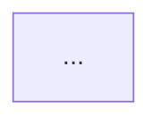

# FP<N>: <Название>

**Status:** plan | design | build | release  
**Created:** YYYY-MM-DD  
**Updated:** YYYY-MM-DD

## Scope

Что входит в этот FP:

- ...
- ...

Что НЕ входит:

- ...
- ...

## Questions

Открытые вопросы (закрывать по мере ответов):

| #   | Question | Answer | Status      |
| --- | -------- | ------ | ----------- |
| 1   | ...      | ...    | open/closed |
| 2   | ...      | ...    | open/closed |

## Decisions (ADRs)

Архитектурные решения:

| #   | Decision | Rationale | Status                     |
| --- | -------- | --------- | -------------------------- |
| 1   | ...      | ...       | proposed/accepted/rejected |

## Requirements

### Use Cases

**Main Flow:**

1. ...
2. ...
3. ...

**Alternate Flows:**

- ...

**Error Flows:**

- ...

### Business Rules

- ...
- ...

### Validations

- ...
- ...

## UX Map

| CTA | Endpoint | State | Page | Mock   | Status    |
| --- | -------- | ----- | ---- | ------ | --------- |
| ... | ...      | ...   | ...  | yes/no | todo/done |

## Architecture

### Components

- Frontend: ...
- Backend: ...
- Database: ...

### Diagrams

**System Design (per CTA):**

```mermaid
sequenceDiagram
  ...
```

**System Interaction Overview:**



## Tests

### UAT/BDD

- [ ] UAT 1: ...
- [ ] UAT 2: ...

### Test Files

- `front/__tests__/fp<N>/...`
- `back/__tests__/fp<N>/...`

### Coverage

- Backend: X%
- Frontend: X%

## Metrics

### Success Metrics

- North Star: ...
- Supporting: ...

### Events

- Event 1: ...
- Event 2: ...

## Plan

| Milestone | Date | Tasks | Owner | Status                |
| --------- | ---- | ----- | ----- | --------------------- |
| 1         | ...  | ...   | ...   | todo/in_progress/done |

## Risks

| Risk | Probability | Impact | Mitigation | Status         |
| ---- | ----------- | ------ | ---------- | -------------- |
| ...  | ...         | ...    | ...        | open/mitigated |

## Dependencies

- ...
- ...

## Artifacts

- Coverage: `artifacts/FP<N>/.../coverage/...`
- Logs: `artifacts/FP<N>/.../logs/...`
- Evidence: `artifacts/FP<N>/.../evidence/...`

## Reflection

**What went well:**

- ...

**Risks:**

- ...

**Next focus:**

- ...

## Evidence

- PR: #...
- CI: https://...
- Demo: https://...
